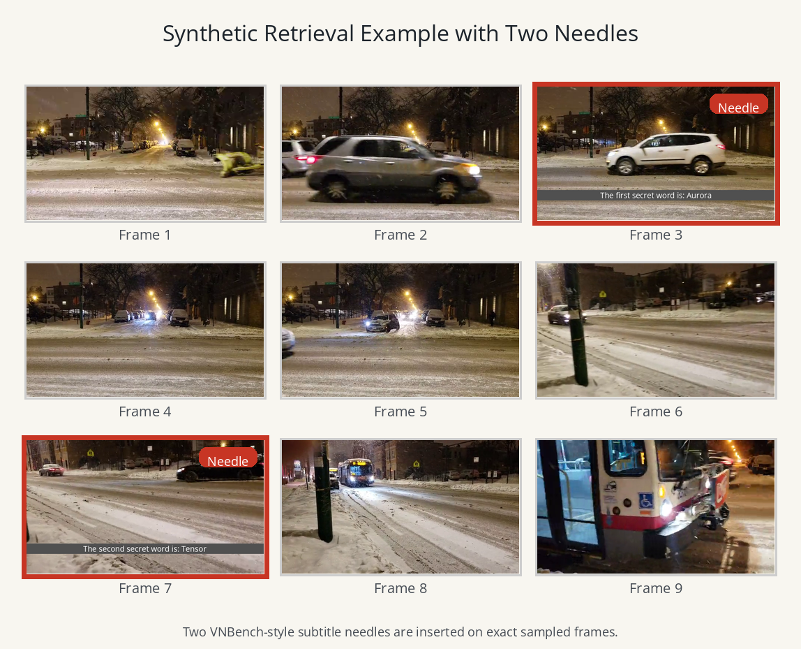

# Multimodal DuoAttention (MMDA): Adapting DuoAttention for Efficient Video Question Answering

**University of Toronto**  
*Rishi Dinesh, Navdeep Singh, Mihir Shah*  
[**Read the Research Paper (ResearchPaper.pdf)**](ResearchPaper.pdf)

---

## 1. Abstract & Core Objective

Streaming Video Question Answering (VQA) with multimodal LLMs is computationally expensive because each incoming frame appends visual tokens, growing the Key-Value (KV) cache and increasing prefill costs. 

We introduce **Multimodal DuoAttention (MMDA)**, which partitions decoder attention heads on multimodal prefixes into:
* **Retrieval Heads**: Crucial for long-range reasoning, retaining full prefix context in GPU memory.
* **Streaming Heads**: Attending only to attention sinks and a short recent window, using a compact, constant-length KV cache.

MMDA reduces KV-cache memory footprints by up to **9.8× on LLaVA-OV 0.5B** and **2.2× on LLaVA-OV 7B** at 32K context with negligible accuracy loss, providing a Pareto-optimal quality-efficiency frontier.

### MMDA Flowchart


---

## 2. Key Contributions

* **VLM Head-Level Specialization (MMDA)**: Freeze backbone weights and optimize one gate $g_h$ per KV head per layer using teacher-student hidden-state MSE distillation and $L_1$ gate-sparsity regularization. Reorder query/key/value projections to pack heads contiguously prior to deployment.
* **Synthetic Video Needles-in-a-Haystack (VideoNIAH) Generator**: Dynamically overlay random subtitle needles (aligned with exact sampled frames) on background videos to force long-range retrieval during gate optimization. Obeys standard VNBench visual specifications.
* **Causal Streaming VQA Benchmarks**: Composed a comprehensive 6-method comparative suite evaluated on RVS-Ego and RVS-Movie.

### Synthetic VideoNIAH Multi-Needle Example


---

## 3. Causal Streaming Methods Suite

We evaluate six causal streaming VQA methods sharded over SLURM and multi-GPU RunPod environments:

1. **`full_streaming`**: Baseline causal KV cache storing all visual tokens in VRAM.
2. **`duo_streaming` (MMDA)**: Core thesis: head-level full vs. sink/recent window partition via contiguous binarization.
3. **`rekv`**: GPU local window + CPU historical offload + QA-time low-dimensional cosine-similarity top-k retrieval.
4. **`duo_plus_rekv`**: Hybrid assembly: MMDA contiguous head gating routed over ReKV retrieved blocks.
5. **`streamingtom`**: Causal Temporal Reduction (CTR) compression + Online Quantized Memory (OQM) 4-bit quantization.
6. **`duo_plus_streamingtom`**: Hybrid execution: Duo routing injected inside StreamingTom's attention forward.

---

## 4. Benchmark Performance Summary

### 4.1 Offline VQA Results (Table 1)
| Model | Method | MLVU | Video-MME | EgoSchema | LongVideoBench-V |
|:---|:---|:---:|:---:|:---:|:---:|
| **LLaVA-OV-0.5B** | Full Attention | 44.57 | 41.59 | 26.40 | 46.00 |
| | **MMDA (Ours)** | 39.21 | 38.30 | 24.00 | 42.26 |
| **LLaVA-OV-7B** | Full Attention | 63.63 | 56.70 | 62.00 | 54.82 |
| | **MMDA (Ours)** | **64.22** | 55.22 | 61.60 | **55.57** |

### 4.2 Online (Streaming) VQA Results (Table 2)
We report accuracy (Judge Score 0–1), answer latency (seconds/answer), and peak GPU memory (GB) on RVS-Ego and RVS-Movie.

| Model | Method | RVS-Ego Accuracy↑ | RVS-Ego Latency↓ | RVS-Ego GPU↓ | RVS-Movie Accuracy↑ | RVS-Movie Latency↓ | RVS-Movie GPU↓ |
|:---|:---|:---:|:---:|:---:|:---:|:---:|:---:|
| **LLaVA-OV-0.5B** | Full Attention | 0.688 | 1.77s | 15.02 GB | 0.767 | 1.34s | 9.20 GB |
| | **MMDA (Ours)** | **0.740** | **0.33s** | 4.83 GB | **0.777** | **0.33s** | 3.49 GB |
| | ReKV | 0.735 | 0.41s | 3.13 GB | 0.764 | 0.63s | 3.18 GB |
| | MMDA + ReKV | 0.737 | 0.59s | 3.15 GB | 0.768 | 0.89s | 3.21 GB |
| | StreamingTom | 0.735 | 0.97s | **2.25 GB** | 0.756 | 0.99s | **2.08 GB** |
| | MMDA + StreamingTom | 0.676 | 2.38s | 2.29 GB | 0.667 | 2.05s | 2.13 GB |
| **LLaVA-OV-7B** | Full Attention | *OOM* | *OOM* | *OOM* | — | — | — |
| | **MMDA (Ours)** | 0.717 | **0.99s** | 23.40 GB | — | — | — |
| | ReKV | **0.736** | 2.42s | **21.90 GB** | — | — | — |
| | MMDA + ReKV | 0.730 | 2.02s | **21.90 GB** | — | — | — |

---

## 5. Environment & Execution Setup

### 5.1 Environment Build
We use two prefix-based conda environments to ensure cross-backend package safety.

#### Environment 1: `duo` (ReKV, MMDA, Plotting)
```bash
# Build
bash setup.sh

# Activate
conda activate "$(pwd)/envs/duo"
export PYTHONPATH="$(pwd)"
```

#### Environment 2: `duo-st` (StreamingTom, LLaVA-NeXT)
```bash
# Build
bash streaming/StreamingTom/scripts/setup_duo_st_env.sh

# Activate
conda activate "$(pwd)/envs/duo-st"
export PYTHONPATH="$(pwd):$(pwd)/streaming/StreamingTom"
```

### 5.2 Verification & Running Smoke Tests
Run installation checks and unified smoke test (1 video/1 conv per method):
```bash
python utils/verify_install.py
bash streaming/run_smoke_all_methods.sh
```

### 5.3 Benchmarking & Merging
To shard evaluations over a SLURM cluster array or multi-GPU RunPod:
```bash
# Local Multi-GPU Runpod sharding (Methods 5-6)
NUM_GPUS=4 NUM_CHUNKS=20 DATASET=rvs_ego \
OUTPUT_ROOT="$(pwd)/outputs/evaluations_streaming/rvs-ego/full_eval/run2" \
bash streaming/StreamingTom/scripts/eval/run_eval_runpod.sh

# Merge results and plot Pareto curves (duo env)
python streaming/merge_all_results.py \
  --rekv-results-dir outputs/evaluations_streaming/rvs-ego/full_eval/run1 \
  --st-results-dir   outputs/evaluations_streaming/rvs-ego/full_eval/run2 \
  --output-dir       outputs/evaluations_streaming/rvs-ego/full_eval/merged_all \
  --run-judge
```
