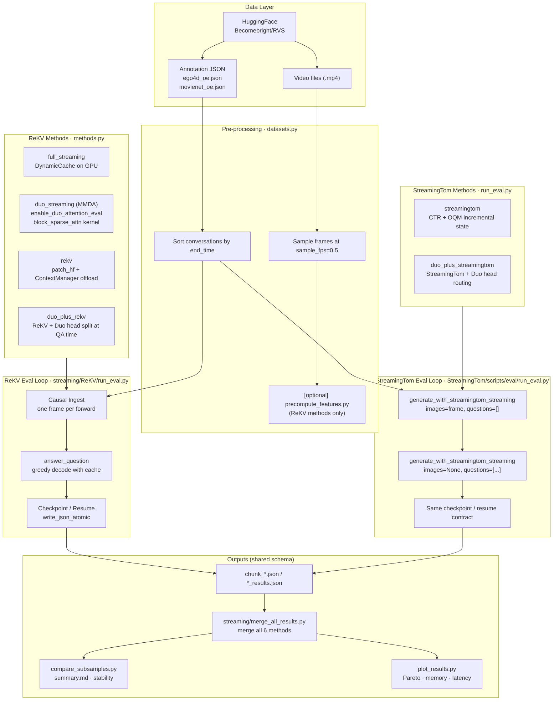
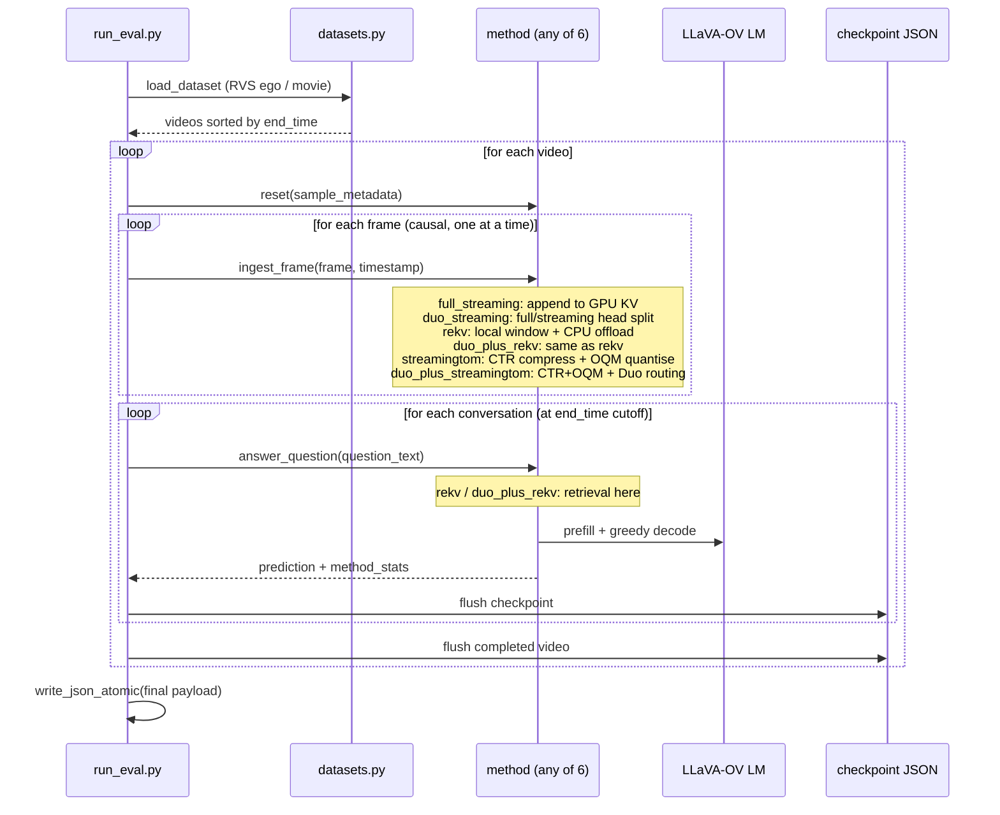
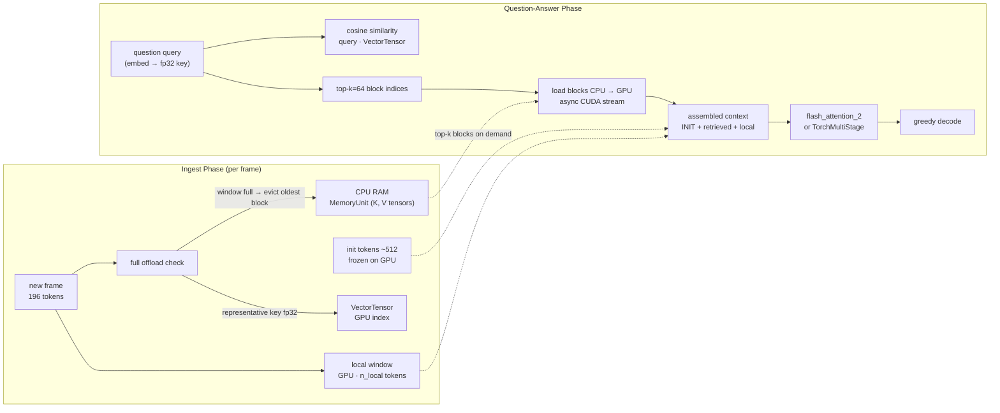
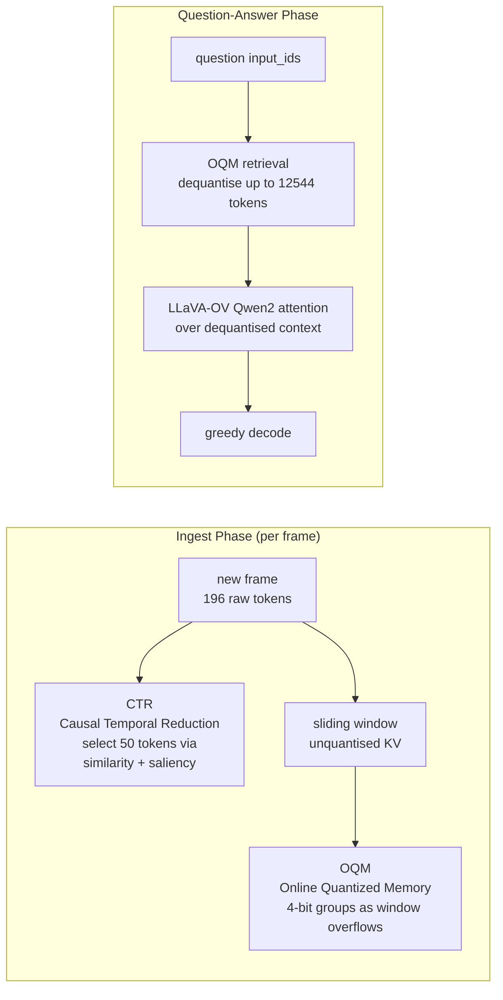
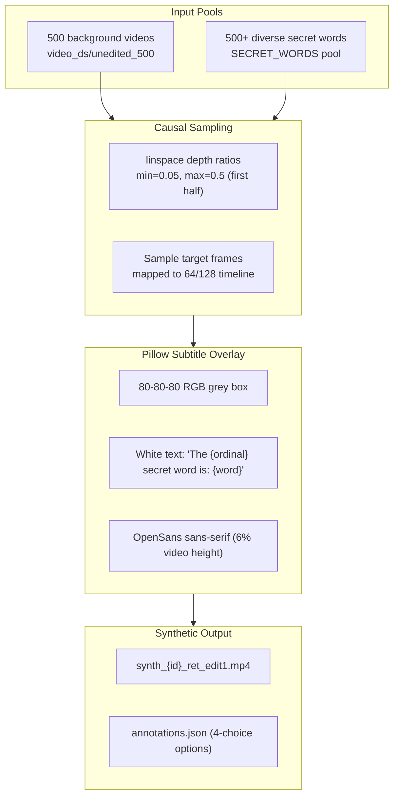

# Multimodal DuoAttention (MMDA): Adapting DuoAttention for Efficient Multimodal Long-Context Video Question Answering

**University of Toronto**  
*Rishi Dinesh, Navdeep Singh, Mihir Shah*  
[**Download Research Paper (ResearchPaper.pdf)**](ResearchPaper.pdf)

---

## 1. Project Vision & Theoretical Framework

Streaming Video Question Answering (VQA) with multimodal Large Language Models (VLMs) is highly expensive. Each incoming video frame adds visual tokens, causing linear KV-cache growth and quadratic prefilling costs. 

### 1.1 Multimodal DuoAttention (MMDA) Core Thesis
MMDA is a decoder-side KV-cache management method for VLMs. Based on the insight that attention heads in long-context models are functionally asymmetric, we partition the language decoder's attention heads into two distinct classes:
1. **Retrieval Heads** (typically $\approx25\%$): Critical for long-range reasoning and visual-text retrieval, retaining full prefix history in GPU memory.
2. **Streaming Heads** (typically $\approx75\%$): Focused on recent tokens and attention sinks, utilizing a lightweight, constant-sized KV cache.

#### MMDA Flowchart


---

### 1.2 Teacher-Student Distillation & Gate Learning
To identify the head partition on multimodal inputs, we freeze the backbone weights (vision encoder and projector) and learn only one gate $g_h$ per KV head per decoder layer:

During the forward pass, we combine the outputs of full and streaming attention (which attends only to sink and recent tokens) for each head using the gate value as the mixing weight:
$$o_h^{\text{mixed}} = (1 - g_h) o_h^{\text{stream}} + g_h o_h^{\text{full}}$$

The student is trained to match the teacher on the answer-token hidden states using Mean Squared Error (MSE) combined with an $L_1$ regularization term (Lasso) to encourage sparsity in the gate values:
$$\mathcal{L} = \text{MSE}\left(H_{\text{ans}}^{\text{student}}, H_{\text{ans}}^{\text{teacher}}\right) + \lambda \sum_h |g_h|$$

Heads with gates near $1$ are binarized as **retrieval heads**, and gates near $0$ act as **streaming heads**. Prior to deployment, query, key, and value projections are contiguously reordered to enable high-efficiency contiguous group slicing during decoding.

---

## 2. System Architecture & Workflows

### 2.1 System Architecture

This diagram shows how annotation and raw video streams flow through the causal preprocessing layer, dispatch to the dual conda environments (`duo` and `duo-st`), execute across the six evaluation backends, and aggregate into post-processed results.



---

### 2.2 Per-Video Evaluation Flow

All six methods share a strict causal evaluation protocol. Frames are ingested incrementally, and questions are answered strictly at their causal timestamps.



---

### 2.3 KV Cache Layout Topology Side-by-Side

Comparative mapping of how Key-Value states are partitioned across active GPU VRAM and host CPU RAM:

```mermaid
graph TD
    subgraph FS["1. full_streaming — GPU only"]
        direction LR
        fs_init["INIT"] --- fs_f1["frame 1"] --- fs_f2["frame 2"] --- fs_dots["···"] --- fs_fn["frame N"]
    end

    subgraph DUO["2. duo_streaming (MMDA) — split by head type"]
        direction LR
        duo_full["full-attn heads ~25%\nall frames · GPU\nblock_sparse_attn"] --- duo_stream["streaming heads ~75%\nSINK + RECENT only · GPU\nblock_sparse_attn"]
    end

    subgraph REKV["3. rekv — GPU local + CPU offload"]
        direction LR
        rekv_init["INIT\nGPU"] --- rekv_cpu["old blocks\nCPU RAM"] --- rekv_local["local window\nn_local tokens\nGPU"]
    end

    subgraph DPR["4. duo_plus_rekv — ReKV offload + Duo head split at QA time"]
        direction LR
        dpr_init["INIT\nGPU"] --- dpr_cpu["CPU offload"] --- dpr_ret["top-k retrieved\nGPU at QA time"] --- dpr_loc["local window\nGPU"]
    end

    subgraph STM["5. streamingtom — CTR + OQM quantised state"]
        direction LR
        stm_init["init tokens\nunquantised"] --- stm_win["sliding window\nunquantised"] --- stm_oqm["OQM groups\n4-bit quantised\nretrieved at QA time"]
    end

    subgraph DPS["6. duo_plus_streamingtom — StreamingTom + Duo head routing"]
        direction LR
        dps_stm["StreamingTom state\n(CTR + OQM)"] --- dps_duo["Duo routing\nper-head inside\nQwen2 forward"]
    end
```



---

## 3. Detailed Explanations of the 6 Streaming Methods

We implement and evaluate **six streaming Video-QA methods** on the **RVS benchmark** (ego-centric 60-min videos and movie clips). Methods ingest video frames causally—one sampled frame at a time—and answer open-ended questions at specific timestamps without any offline whole-video prefill.

### 3.1 Full Streaming (`full_streaming`)
* **Strategy**: Standard full-attention causal cache on the GPU (`FlashAttention-2`).
* **Ingest**: Each incoming frame adds 196 tokens, which are cached directly in VRAM.
* **QA Prefill**: Full attention over all past visual and text history.
* **Role**: Serves as the maximum quality upper-bound baseline; scales linearly in VRAM.

### 3.2 Duo Streaming (`duo_streaming` / MMDA)
* **Strategy**: True head-level asymmetric attention routing on the GPU.
* **Ingest**: Query/Key/Value projections are contiguously reordered at load time. Retrieval heads ($\approx25\%$) maintain full context history. Streaming heads ($\approx75\%$) maintain a sliding window of 256 sink tokens and 512 recent tokens, permanently dropping middle tokens.
* **QA Prefill**: Streaming heads attend via a blocksparse CUDA kernel (`block_sparse_attn`).
* **Role**: Bounded GPU memory scaling regardless of video length; extremely fast decoding.

### 3.3 ReKV (`rekv`)
* **Strategy**: GPU local window + CPU historical offloading + demand-driven QA retrieval.
* **Ingest**: Init tokens (512 tokens) and the most recent 15,000 tokens are cached on the GPU. Older blocks (196 tokens/frame) are offloaded to host CPU RAM (`MemoryUnit`). Each block's keys are stored on the GPU in a low-dimensional representative index (`VectorTensor`).
* **QA Prefill**: Cosine similarity is computed between the question's query and all representative key vectors. The top-64 blocks are loaded back from CPU to GPU over an asynchronous CUDA stream, assembling `[init] + [top-64 retrieved] + [local window]` for full attention.



### 3.4 Duo + ReKV (`duo_plus_rekv`)
* **Strategy**: ReKV offload and retrieval combined with Duo contiguous head routing.
* **Ingest**: Identical to ReKV (CPU offload during ingestion).
* **QA Prefill**: ReKV retrieves the top-64 blocks and assembles the context. Over the assembled context, Duo head routing is applied: full-attention heads attend over the entire assembled context, while streaming heads attend over only the sink + local window using the blocksparse kernel.

### 3.5 StreamingTom (`streamingtom`)
* **Strategy**: Causal Temporal Reduction (CTR) compression + Online Quantized Memory (OQM) 4-bit quantization.
* **Ingest**: CTR causally compresses the 196 tokens/frame down to 50 tokens using frame similarity and saliency matrices. Historical tokens are quantized to 4-bit integers and offloaded.
* **QA Prefill**: Dequantizes context on demand (up to a budget of 12,544 tokens) at QA time.



### 3.6 Duo + StreamingTom (`duo_plus_streamingtom`)
* **Strategy**: Duo routing injected inside StreamingTom's attention forward (`modeling_qwen2_revise.py`).
* **Ingest**: Incremental CTR compression and 4-bit quantization identical to StreamingTom.
* **QA Prefill**: Full heads attend over the entire dequantized StreamingTom cache. Streaming heads attend only over the sink + local sliding window.

---

## 4. Empirical Evaluation Results

We evaluate our method MMDA against all standard streaming baselines.

### 4.1 Offline VQA Results (Table 1)
Offline Video-QA performance (MLVU, Video-MME, EgoSchema, and LongVideoBench-V):

| Model | Method | MLVU | Video-MME | EgoSchema | LongVideoBench-V |
|:---|:---|:---:|:---:|:---:|:---:|
| **LLaVA-OV-0.5B** | Full Attention | 44.57 | 41.59 | 26.40 | 46.00 |
| | **MMDA (Ours)** | 39.21 | 38.30 | 24.00 | 42.26 |
| **LLaVA-OV-7B** | Full Attention | 63.63 | 56.70 | 62.00 | 54.82 |
| | **MMDA (Ours)** | **64.22** | 55.22 | 61.60 | **55.57** |

---

### 4.2 Online (Streaming) VQA Results (Table 2)
Streaming VQA results on RVS-Ego (ego-centric 60-min videos) and RVS-Movie. We report accuracy (LLaVA-OV 0.5B judge score, 0–1), answer latency (secs/answer), and peak GPU memory (GB).

| Model | Method | RVS-Ego Accuracy↑ | RVS-Ego Latency↓ | RVS-Ego GPU↓ | RVS-Movie Accuracy↑ | RVS-Movie Latency↓ | RVS-Movie GPU↓ |
|:---|:---|:---:|:---:|:---:|:---:|:---:|:---:|
| **LLaVA-OV-0.5B** | Full Attention | 0.688 | 1.77s | 15.02 GB | 0.767 | 1.34s | 9.20 GB |
| | **MMDA (Ours)** | **0.740** | **0.33s** | 4.83 GB | **0.777** | **0.33s** | 3.49 GB |
| | ReKV | 0.735 | 0.41s | 3.13 GB | 0.764 | 0.63s | 3.18 GB |
| | MMDA + ReKV | 0.737 | 0.59s | 3.15 GB | 0.768 | 0.89s | 3.21 GB |
| | StreamingTom | 0.735 | 0.97s | **2.25 GB** | 0.756 | 0.99s | **2.08 GB** |
| | MMDA + StreamingTom | 0.676 | 2.38s | 2.29 GB | 0.667 | 2.05s | 2.13 GB |
| **LLaVA-OV-7B** | Full Attention | *OOM* | *OOM* | *OOM* | — | — | — |
| | **MMDA (Ours)** | 0.717 | **0.99s** | 23.40 GB | — | — | — |
| | ReKV | **0.736** | 2.42s | **21.90 GB** | — | — | — |
| | MMDA + ReKV | 0.730 | 2.02s | **21.90 GB** | — | — | — |

---

## 5. Dynamic VideoNIAH Synthetic Generator (NIAH)

We provide a dynamic, on-the-fly multi-needle synthetic Video-NIAH data generator to construct long-context retrieval probes and optimize head-level gating.

### 5.1 Dynamic Data Creation Pipeline
* **Background video pool**: 500 numbered unedited background videos (average duration 76.5 seconds).
* **On-The-Fly Subtitle Burning**: Custom subtitles are burned onto raw video arrays inside `__getitem__`.
* **Perfect Frame Alignment**: Needles are burned onto the array after the 64/128 chunk timeline is sampled, squashing coordinate desync or visual flicker.
* **VNBench Subtitle Layout**: White sans-serif font (OpenSans at 6% frame height) visually overlaid on an $80\text{-}80\text{-}80$ RGB grey box placed at $85\%$ screen depth.
* **Target Text Templates**: Expected prompt targets dynamically adapt based on query indices: `The {ordinal} secret word is: {word}`.



### 5.2 VideoNIAH Generation Arguments
- `--num_videos`: Total synthetic videos to generate.
- `--num_needles`: Distinct needles to insert per video (default: `10` to align with MMDA paper).
- `--min_depth_ratio` / `--max_depth_ratio`: Valid temporal intervals for needles drop (e.g. `0.05` to `0.5`).
- `--needle_duration`: subtitle visibility in seconds (default: `2.0` to match VNBench).

### 5.3 On-the-fly Dataloader Ingestion (No Disk Pre-Rendering)
You can run the dynamic generator on-the-fly during training by pointing your clustering scripts directly to the unedited background videos:
```bash
python -m duo_attn.train \
    --video_dataset_name dynamic_synthetic \
    --video_root video_ds/unedited_500 \
    --num_needles 5 \
    --min_needle_depth_ratio 0.2 \
    --max_needle_depth_ratio 0.8
```

### Synthetic VideoNIAH Multi-Needle Visual Example


---

## 6. Environment Setup

This project uses **two prefix-based conda environments** to guarantee package stability across backends.

### 6.1 Conda Environment 1: `duo` (ReKV, MMDA, and Plotting Tools)
* **Path**: `<repo>/envs/duo`
* **Key Modules**: PyTorch 2.4.1, flash-attn 2.6.3, block_sparse_attn (Duo).

Build the environment:
```bash
# Direct Setup
bash setup.sh

# Or on SLURM Cluster:
sbatch scripts/setup_env.sh
```

Activate the environment:
```bash
conda activate "$(pwd)/envs/duo"
export PYTHONPATH="$(pwd)"
```

### 6.2 Conda Environment 2: `duo-st` (StreamingTom Backend)
* **Path**: `<repo>/envs/duo-st`
* **Key Modules**: PyTorch 2.5.1, flash-attn 2.7.4, flashinfer 0.2.2, LLaVA-NeXT, streamingtom.

Build the environment:
```bash
# On RunPod / Bare Multi-GPU Node:
bash streaming/StreamingTom/scripts/setup_duo_st_env.sh

# On SLURM Cluster:
sbatch streaming/StreamingTom/scripts/setup_streamingtom_env.sh
```

Activate the environment:
```bash
conda activate "$(pwd)/envs/duo-st"
export PYTHONPATH="$(pwd):$(pwd)/streaming/StreamingTom"
```

---

## 7. Execution & Orchestration Manual

### 7.1 Verification & Environment Diagnostics
Run the install check in your active `duo` environment:
```bash
python utils/verify_install.py
```

### 7.2 Run Smoke Test (All 6 Methods, 1 Video)
Verifies that all 6 methods run successfully on a short video clip without OOMs:
```bash
# Submit to SLURM Node
sbatch streaming/run_smoke_all_methods.sh

# Or execute locally
bash streaming/run_smoke_all_methods.sh
```

### 7.3 Full Dataset Evaluations

#### ReKV Methods 1–4 (on `duo` environment)
Runs `full_streaming`, `duo_streaming` (MMDA), `rekv`, and `duo_plus_rekv` in parallel across 10 chunks using SLURM arrays:
```bash
# RVS-Ego Evaluation
for METHOD in full_streaming duo_streaming rekv duo_plus_rekv; do
  DATASET=rvs_ego METHOD=${METHOD} NUM_CHUNKS=10 SPARSITY=0.75 \
  DEPLOY_SINK_SIZE=256 DEPLOY_RECENT_SIZE=512 \
  OUTPUT_ROOT="${PWD}/outputs/evaluations_streaming/rvs-ego/full_eval/run1" \
  sbatch --array=0-9 --mem=120G \
         --output="${PWD}/logs/ego-${METHOD}-%a-%j.out" \
         scripts/run_streaming_eval_slurm_array.sh
done
```

#### StreamingTom Methods 5–6 (on `duo-st` environment)
Runs `streamingtom` and `duo_plus_streamingtom` in parallel across 20 chunks using SLURM arrays:
```bash
DATASET=rvs_ego NUM_CHUNKS=20 RESUME=0 \
OUTPUT_ROOT="${PWD}/outputs/evaluations_streaming/rvs-ego/full_eval/run2" \
bash streaming/StreamingTom/scripts/eval/run_streamingtom_vs_duo_plus_run2.sh submit
```

### 7.4 Running on Multi-GPU RunPod (No SLURM)
For multi-GPU bare metal nodes (RunPod, Lambda Labs, etc.), use the custom chunk runner to shard evaluations across all active GPUs:
```bash
NUM_GPUS=4 NUM_CHUNKS=20 DATASET=rvs_ego \
OUTPUT_ROOT="$(pwd)/outputs/evaluations_streaming/rvs-ego/full_eval/run2" \
bash streaming/StreamingTom/scripts/eval/run_eval_runpod.sh
```

### 7.5 Merging Results & Plotting Pareto Frontiers
Once all runs are complete, activate the `duo` environment and run the merge script:
```bash
python streaming/merge_all_results.py \
  --rekv-results-dir outputs/evaluations_streaming/rvs-ego/full_eval/run1 \
  --st-results-dir   outputs/evaluations_streaming/rvs-ego/full_eval/run2 \
  --output-dir       outputs/evaluations_streaming/rvs-ego/full_eval/merged_all \
  --run-judge
```
*Note: `--run-judge` triggers `judge_results.py` to calculate LLM-based semantic score metrics (Judge 0–1) dynamically prior to plotting.*

---

## 8. Repository File Map

```
├── README.md                      # Unified Paper-Aligned Project Manual (MMDA + 6 Methods)
├── ResearchPaper.pdf              # MMDA Research Paper (University of Toronto)
├── DuoAttention.pdf               # Original Reference DuoAttention Paper (MIT Han Lab)
├── setup.sh                       # Local environment builder script
├── start.sh                       # RunPod SSH entrypoint dispatcher
│
├── generator/                     # Dynamic Subtitle Synthetic Video Generator
│   ├── generate_synthetic_videos.py   # Main video needle burner (VNBench Style)
│   ├── verify_dynamic_dataloader.py   # On-the-fly training dataset loader tester
│   └── README.md                  # Generator manual & CLI guidelines
│
├── duo_attn/                      # Original DuoAttention gate distillation core
│   ├── train.py                   # Teacher-student gate optimizer (distillation + L1 loss)
│   └── patch/                     # PyTorch layers, rotary, RMSNorm, and sparse-attention patches
│
├── streaming/                     # Streaming VQA Orchestrator & Evaluation Suite
│   ├── run_smoke_all_methods.sh   # Smoke test script running all 6 methods
│   ├── merge_all_results.py       # Aggregator merging sharded chunk files
│   ├── rekv_st_duo.md             # Complete benchmarking raw reference file
│   │
│   ├── ReKV/                      # ReKV Suite (Methods 1-4)
│   │   ├── run_eval.py            # Main causal loop (Shared by ST loop)
│   │   ├── methods.py             # Causal method class wrappers
│   │   ├── datasets.py            # RVS annotation parser & Decord reader
│   │   ├── precompute_features.py # Offline visual feature extractor
│   │   ├── plot_results.py        # Plotting suite mapping Pareto curves
│   │   ├── judge_results.py       # GPT/Qwen open-ended semantic scoring judge
│   │   └── rekv_core/             # CPU offloader (MemoryUnit, VectorTensor)
│   │
│   └── StreamingTom/              # StreamingTom Suite (Methods 5-6)
│       └── scripts/eval/
│           ├── run_eval.py        # StreamingTom evaluation wrapper
│           ├── run_eval_runpod.sh # Sharding dispatcher for multi-GPU RunPod
│           └── setup_duo_st_env.sh# Setup installer for duo-st conda env
```
