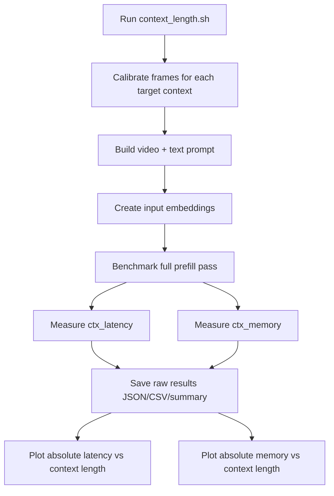
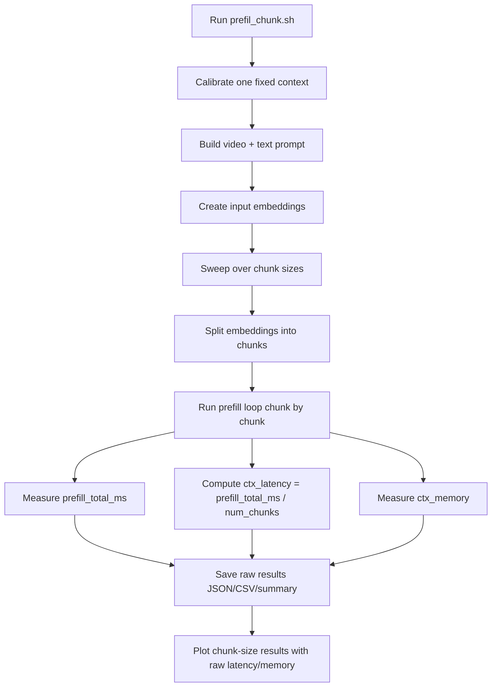
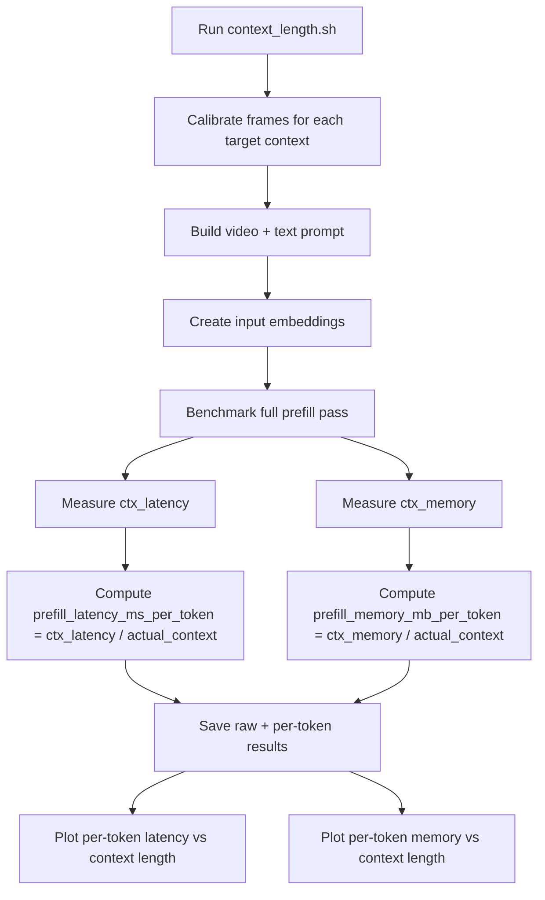
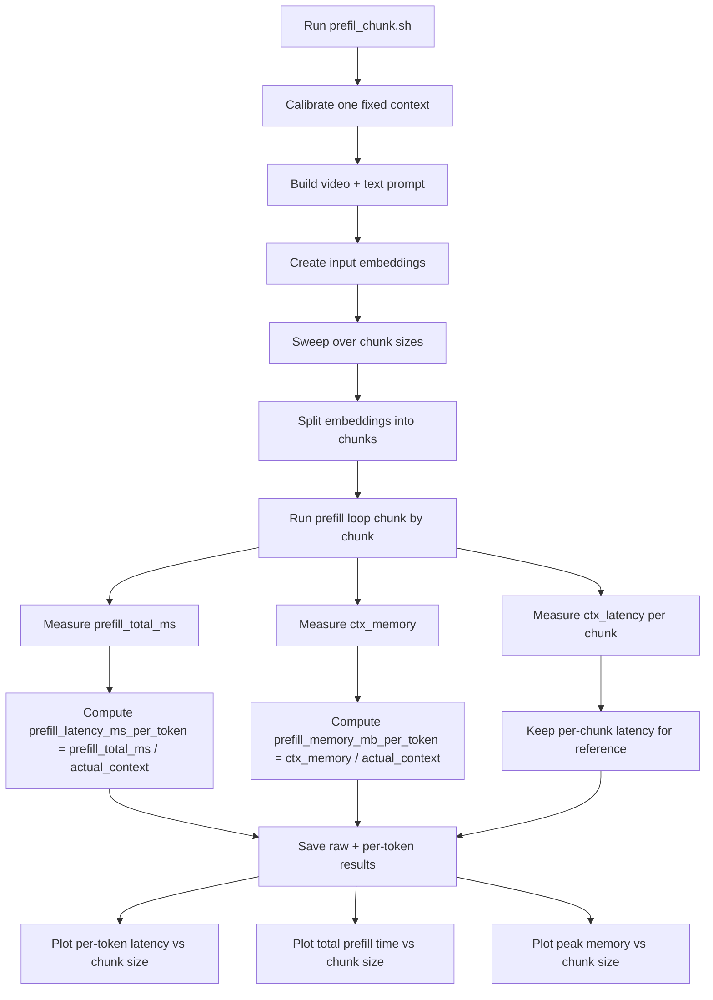

# Prefill Metric Flowcharts

This note explains what the previous benchmarking scripts were doing and what the updated scripts do now.

The two relevant entry points are:

- `scripts/prefill_eval/context_length.sh`
- `scripts/prefill_eval/prefil_chunk.sh`

## Previous Behavior

Previously, the scripts reported raw prefill latency and raw peak memory.

### `context_length.sh` before

- The script swept over different context lengths.
- For each context length, it built one video-text prompt near the target token count.
- It benchmarked one full prefill pass over the whole prompt.
- It stored:
  - `ctx_latency`: average milliseconds for one full prefill run
  - `ctx_memory`: peak GPU memory in MB during prefill
- The plot showed absolute latency and absolute memory.

### `prefil_chunk.sh` before

- The script first locked a single context length.
- Then it swept over several `prefill_chunk_size` values.
- For each chunk size, it split the full prompt into chunks and prefills chunk-by-chunk.
- It stored:
  - `prefill_total_ms`: total prefill time across all chunks
  - `ctx_latency`: average milliseconds per chunk
  - `ctx_memory`: peak GPU memory in MB during the prefill loop
- The plot mainly showed absolute totals and absolute memory.

## New Behavior

Now the scripts still save the raw metrics, but they also derive per-token metrics from them.

## Updated Metric Definitions

### For `context_length.sh`

- Raw metric:
  - `ctx_latency` = average milliseconds for one full prefill run
- New derived metric:
  - `prefill_latency_ms_per_token = ctx_latency / actual_context`
  - `prefill_memory_mb_per_token = ctx_memory / actual_context`

### For `prefil_chunk.sh`

- Raw metrics:
  - `prefill_total_ms` = total prefill time across all chunks
  - `ctx_latency` = average milliseconds per chunk
- New derived metric:
  - `prefill_latency_ms_per_token = prefill_total_ms / actual_context`
  - `prefill_memory_mb_per_token = ctx_memory / actual_context`

## Current Flow

### `context_length.sh` now

- The script still sweeps context length as before.
- It still measures raw prefill latency and raw peak memory.
- Then it derives per-token values before saving and plotting.
- The plot now uses:
  - per-token latency
  - per-token normalized memory

### `prefil_chunk.sh` now

- The script still locks one context and sweeps chunk size as before.
- It still measures total prefill time, average per chunk, and peak memory.
- Then it derives per-token values before saving and plotting.
- The plot now uses:
  - per-token prefill latency
  - total prefill time
  - peak prefill memory

## Short Summary

- Before: the plots used raw latency and raw peak memory.
- Now: the scripts still keep the raw metrics, but they derive and plot per-token metrics where appropriate.
- This makes comparisons across different context lengths more meaningful, because the values are normalized by token count.
