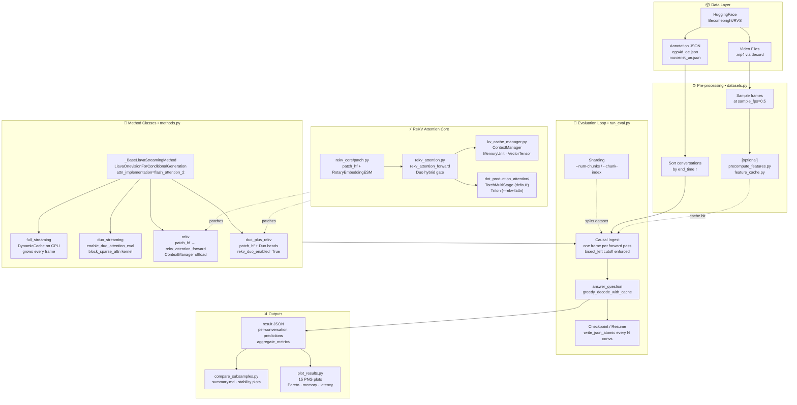
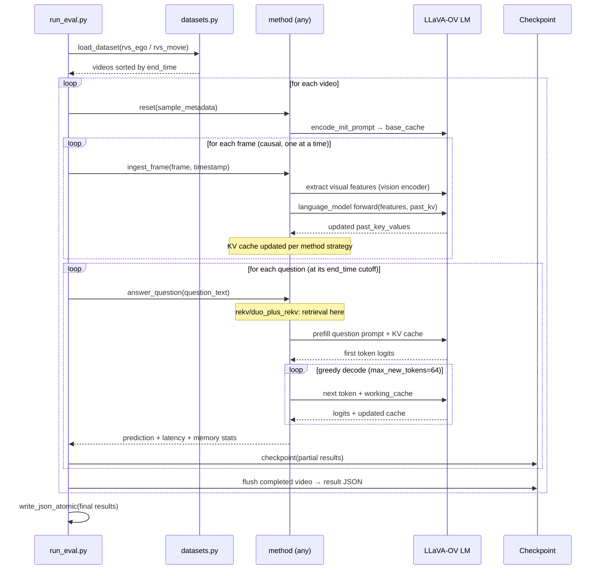
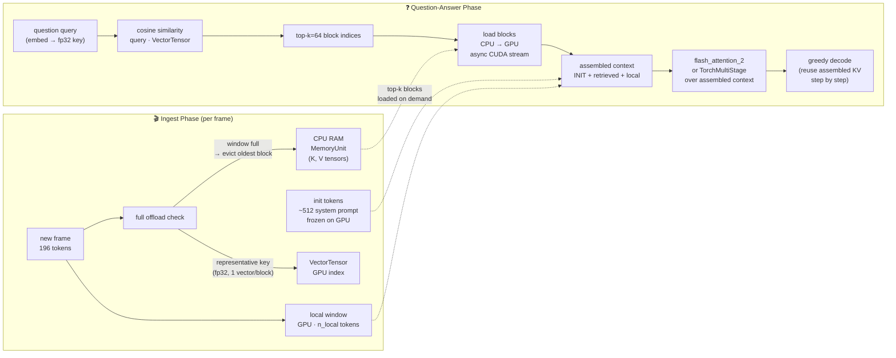
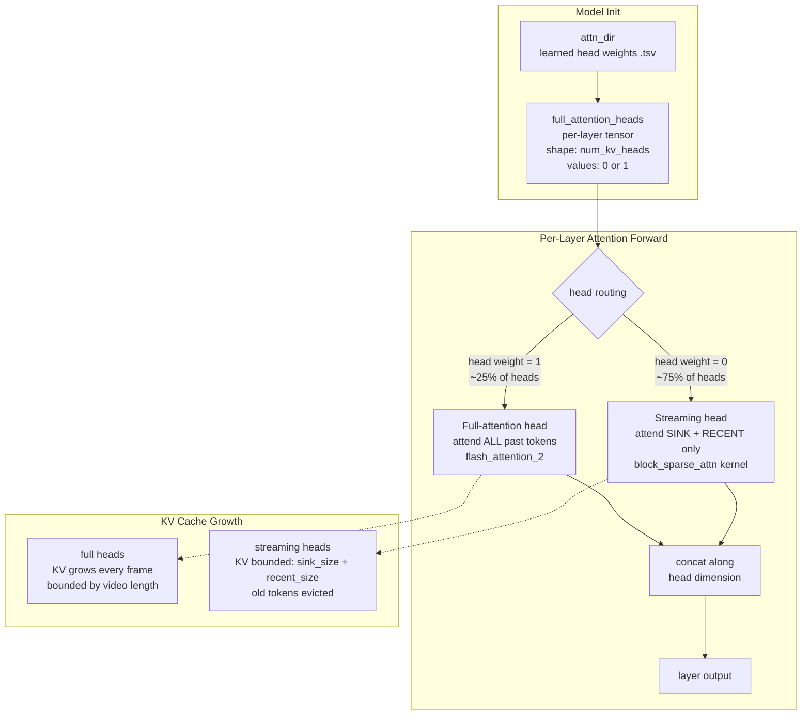
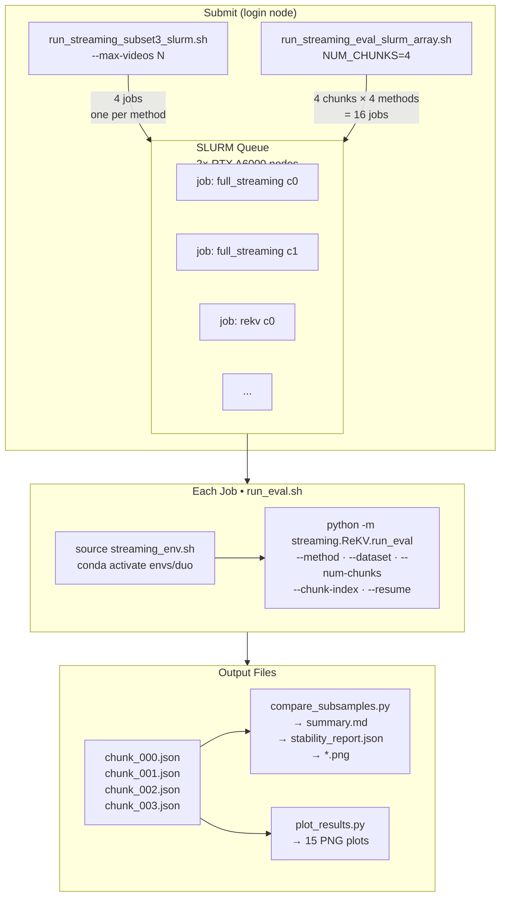

# ReKV + DuoAttention Streaming — Project Guide

Working reference for the `streaming/ReKV` module on the `exp/nv-gpu-inference` branch.

**Target:** NVIDIA SLURM cluster (Toronto CS, login node: `comps0`) · CUDA · conda env at `<repo>/envs/duo`

---

## 1. What This Project Does

We evaluate four streaming video-QA methods on the **RVS** benchmark (ego-centric and movie videos). Each method ingests video frames causally (one sampled frame at a time) and answers open-ended questions about what it saw — without replaying the video offline. The methods differ only in how they manage the growing KV cache.

The primary goal is to compare **quality** (ROUGE-L F1), **answer latency**, and **GPU/CPU memory** across methods as video length scales.

---

## 2. Four Methods

| Method | What it does | Memory model |
|---|---|---|
| `full_streaming` | Plain causal KV cache; keeps all frame tokens on GPU | KV cache grows linearly (~4.3 GB for 1800-frame video); flash_attention_2 keeps attention O(seq_len) so no attention-matrix OOM |
| `duo_streaming` | Duo head routing: retrieval heads keep full KV; streaming heads use sink+recent window only | Bounded GPU RAM; no CPU offload; requires `block_sparse_attn` |
| `rekv` | Local window on GPU; old blocks offloaded to CPU; top-k blocks retrieved at question time | ~3.4 GB GPU + ~4.3 GB CPU for 1800-frame video |
| `duo_plus_rekv` | ReKV assembles retrieved context, then Duo head routing applied over it | ~3.4 GB GPU + ~4.3 GB CPU (same as rekv); approximate hybrid |

All four share the same frame schedule, the same model, and the same greedy decode path.

**Current smoke-test results (1 video, 259 questions, RVS-Ego):**

| Method | ROUGE-L F1 | Latency (s) | Peak GPU | Peak CPU offload |
|---|---|---|---|---|
| `duo_streaming` | 0.146 | 0.464 | 8.4 GB | — |
| `rekv` | 0.275 | 0.082 | 3.4 GB | 4.3 GB |
| `duo_plus_rekv` | 0.268 | 0.149 | 3.4 GB | 4.3 GB |
| `full_streaming` | TBD (running with flash_attn fix) | TBD | TBD | — |

`duo_streaming` scores lower than `rekv` because the streaming heads (50% of heads at s=0.5) see only a small sink+recent window and miss mid-video context. `rekv` retrieves the most relevant blocks from CPU and wins on quality.

### Method details — step by step

**`full_streaming`**
1. Loads LLaVA-OV with `flash_attention_2` — tiled kernel, never materialises the O(seq²) matrix
2. Each video frame: runs a full LM forward, appending 196 new KV tokens to the cache on GPU
3. KV cache grows linearly for the full video — all frames stay resident in GPU VRAM
4. At question time: feeds the question into the model with the full accumulated KV cache
5. Greedy decodes token-by-token, reusing the growing KV cache at each step
6. **Upper-bound baseline** — attends over every ingested frame, no compression or retrieval

*Underlying:* `flash_attention_2`. Standard HuggingFace DynamicCache. No offload, no sparsity.

---

**`duo_streaming` (s=0.75)**
1. Loads model with `flash_attention_2`, then `enable_duo_attention_eval` replaces attention on each layer
2. Learned head weights (from `attn_dir`) classify each KV head: 25% are **full-attention heads** (keep all tokens), 75% are **streaming heads** (keep only sink + recent window)
3. During ingest: full heads accumulate all KV tokens normally; streaming heads maintain a fixed-size sink+recent window — evicting old tokens as new frames arrive
4. KV cache size stays **bounded** regardless of video length (streaming heads never grow)
5. At question time: full heads attend over all past tokens; streaming heads attend only over their window via the **blocksparse** CUDA kernel
6. Whatever fell outside the streaming window is permanently lost — no retrieval

*Underlying:* `block_sparse_attn` for streaming heads, `flash_attention_2` for full-attention heads. No CPU offload.

---

**`rekv` (topk=64, n_local=15000)**
1. Loads model with `flash_attention_2`, then `patch_hf` replaces every attention layer's forward with `rekv_attention_forward`
2. During ingest: most recent 15,000 tokens (n_local) stay on GPU; older blocks (one block = one frame = 196 tokens) are **offloaded to CPU RAM** as `MemoryUnit` objects; a compact fp32 representative key vector per block stays on GPU
3. The init tokens (first ~512 system-prompt tokens) are frozen on GPU permanently
4. At question time: cosine similarity between question query and all block key vectors → **top-64 blocks** loaded back from CPU to GPU
5. Assembled context: `[init tokens] + [top-64 retrieved blocks] + [local 15k window]` — full attention over this for the answer
6. Greedy decode reuses the assembled KV cache step-by-step; CPU offload released after each question

*Underlying:* `TorchMultiStageDotProductionAttention` (tiled PyTorch) for ReKV inner attention. `flash_attention_2` as base model. Async CUDA streams for CPU↔GPU offload.

---

**`duo_plus_rekv` (s=0.75, topk=64)**
1. Loads model with `flash_attention_2`, applies both ReKV's `patch_hf` and Duo's head weight registration — `rekv_duo_enabled=True` activates the hybrid branch
2. During ingest: identical to `rekv` — local window on GPU, old blocks offloaded to CPU
3. At question time: ReKV retrieval runs first — same cosine-similarity top-64 selection assembles `[init] + [retrieved] + [local]`
4. Over the assembled context, **Duo head routing is applied**: 25% of heads attend over the full assembled context; 75% streaming heads attend only over init + local window
5. `duo_n_init` is extended to cover Duo's sink tokens so they are always present in the retrieved context
6. Greedy decode over the hybrid-assembled KV cache

*Underlying:* `block_sparse_attn` for streaming heads during decode. `TorchMultiStageDotProductionAttention` for ReKV retrieval. `flash_attention_2` as base. CPU offload same as rekv.

---

### What the comparison will show

| Axis | Expected ordering |
|---|---|
| **Quality (ROUGE-L F1)** | `full_streaming` ≥ `rekv` ≈ `duo_plus_rekv` > `duo_streaming` |
| **Answer latency** | `rekv` < `full_streaming` < `duo_plus_rekv` < `duo_streaming` |
| **Peak GPU memory** | `rekv` ≈ `duo_plus_rekv` < `duo_streaming` < `full_streaming` |
| **CPU offload** | `rekv` ≈ `duo_plus_rekv` (~4 GB) vs none for others |

- `full_streaming` is the uncompressed upper bound on quality; memory cost grows with video length
- `rekv` trades a small quality drop for dramatically lower and **constant** GPU memory regardless of video length
- `duo_streaming` at s=0.75 has tighter memory than s=0.5 but loses more context (75% streaming heads), so quality drops further
- `duo_plus_rekv` attempts to recover quality over plain `rekv` by applying Duo routing over the retrieved context, but adds retrieval overhead

---

## 3. Architecture & Workflow Diagrams

### 3.1 System Architecture



---

### 3.2 Per-Video Evaluation Flow



---

### 3.3 KV Cache Layout — All Four Methods

```mermaid
block-beta
    columns 12

    block:label_fs["full_streaming"]:1
    end
    block:fs_init["INIT\n(frozen)"]:1
    end
    block:fs_f1["frame 1"]:1
    end
    block:fs_f2["frame 2"]:1
    end
    block:fs_dots["· · ·"]:4
    end
    block:fs_fn["frame N\n(latest)"]:2
    end
    space:2

    block:label_duo["duo_streaming"]:1
    end
    block:duo_full["── full-attn heads (25%) ──────────────────────"]:8
    end
    block:duo_sink["SINK"]:1
    end
    block:duo_dots["···"]:1
    end
    block:duo_rec["RECENT"]:1
    end
    space:1

    block:label_rekv["rekv"]:1
    end
    block:rekv_init["INIT\n(GPU)"]:1
    end
    block:rekv_cpu["◄── old blocks on CPU RAM (offloaded) ──────►"]:6
    end
    block:rekv_local["── local window ──\n(GPU, n_local tokens)"]:3
    end
    space:1

    block:label_dpr["duo_plus_rekv"]:1
    end
    block:dpr_init["INIT\n(GPU)"]:1
    end
    block:dpr_cpu["◄── CPU offload ──────►"]:4
    end
    block:dpr_ret["top-k retrieved\n(GPU at QA time)"]:2
    end
    block:dpr_loc["local\nwindow"]:2
    end
    space:2
```

> **Note:** At question time, `rekv` and `duo_plus_rekv` load top-k blocks from CPU → GPU, assemble `[INIT] + [retrieved] + [local]`, then run attention over this assembled context only.

---

### 3.4 ReKV Ingest & Retrieval Detail



---

### 3.5 Duo Head Routing (shared by `duo_streaming` and `duo_plus_rekv`)



---

### 3.6 SLURM Job Submission & Output Structure



---

## 4. End-to-End Data Flow

## 5. Module Map — What Each File Does

### Core evaluation loop

| File | What it does |
|---|---|
| `run_eval.py` | **Main entry point.** Causal ingest loop, checkpoint/resume, sharding (`--num-chunks`, `--chunk-index`), writes result JSON |
| `methods.py` | All four method classes. Shared: feature extraction, `greedy_decode_with_cache`, `answer_question` |
| `datasets.py` | Loads RVS annotation JSONs, sorts by `end_time`, samples frames, resolves video paths, decords frames |
| `common.py` | Data classes: `StreamingVideoSample`, `StreamingConversation`. Scoring: ROUGE-L, BLEU, token F1, exact match |
| `feature_cache.py` | Validates loaded cache against run schedule (sample_fps, frame indices, timestamps, tensor shape) |
| `precompute_features.py` | Batch-extract visual tokens and save to disk; must use same sample_fps as eval |

### Analysis and plotting

| File | What it does |
|---|---|
| `compare_subsamples.py` | Given N result JSONs, produces `summary.md` (score table), `stability_report.json`, and stability PNGs |
| `plot_results.py` | Paper-style plots: quality vs. latency, quality vs. memory, Pareto curves, per-conversation timelines |
| `plot_profile.py` | Latency and memory curves from profiling runs (frame count vs. metric) |
| `judge_results.py` | LLM-based semantic scoring (0–5 scale) using an external judge model |
| `rescore_results.py` | Recompute token/ROUGE metrics on existing result JSONs without re-running eval |
| `build_qualitative_bundle.py` | Creates `qualitative_bundle.md`: side-by-side predictions across methods for the same questions |
| `build_backend_audit_report.py` | Markdown comparison of backend stack across methods and hardware |
| `profile_streaming.py` | Single-video profiling run: records latency and memory at each frame count checkpoint |
| `smoke_test.py` | Fast unit tests (no GPU required): dataset loading, causal ingest, resume logic, plotting |
| `validate_runtime_env.py` | Prints actual backend stack (flash-attn, blocksparse, flashinfer) and confirms kernel selection |

### ReKV attention core

| File | What it does |
|---|---|
| `rekv_core/patch.py` | `patch_hf`: replaces HF attention forward with `rekv_attention_forward` on each layer; installs `RotaryEmbeddingESM` |
| `rekv_core/attention/rekv_attention.py` | `rekv_attention_forward`: local window + init tokens + retrieved blocks; Duo hybrid gate |
| `rekv_core/attention/kv_cache_manager.py` | `ContextManager`: CPU offload engine. `MemoryUnit`: one offloaded block. `VectorTensor`: GPU-side key vectors for cosine-similarity retrieval |
| `rekv_core/attention/rope.py` | `RotaryEmbeddingESM` with distance scaling for long-sequence positional encoding |
| `rekv_core/attention/utils.py` | `repeat_kv` for GQA head expansion |
| `rekv_core/attention/dot_production_attention/` | Multi-stage attention: `TorchMultiStageDotProductionAttention` (default) or Triton (`--rekv-fattn`) |

### Scripts

| File | What it does |
|---|---|
| `scripts/run_streaming_subset3_slurm.sh` | **Main submit script.** Submits 4 SLURM jobs (one per method) for N-video subset eval |
| `streaming/ReKV/run_eval.sh` | Single-GPU SLURM job wrapper. Hardcodes ROOT and env vars; calls `python -m streaming.ReKV.run_eval` |
| `scripts/run_streaming_eval_slurm_array.sh` | Multi-GPU sharded array: splits dataset across N workers |
| `scripts/streaming_env.sh` | Conda activation: tries project prefix `envs/duo` first, then named `duo` env |
| `setup.sh` | Builds conda env from scratch; installs flash-attn, block_sparse_attn, decord |

---

## 6. Attention Architecture Deep Dive

### 5.1 ReKV attention forward (`rekv_attention.py`)

The forward is organized in two phases depending on `past_key_value`:

**Ingest phase** (encoding video frames, managed by `ContextManager`):
- `ContextManager.append(local_q, local_k, local_v, global_q, global_k, global_v)`
- Local KV stays on GPU (up to `n_local` tokens)
- Init tokens (first `n_init` tokens) are frozen on GPU
- Blocks beyond `n_local + n_init` are offloaded to CPU as `MemoryUnit` objects
- Per-block representative key vector stored in `VectorTensor` (fp32, GPU) for retrieval

**Retrieval/answer phase** (triggered by `set_retrieval()` on `ContextManager`):
- `_calc_block_topk`: cosine similarity between question query and block key vectors → selects top-k blocks
- Retrieved blocks loaded from CPU to GPU
- Assembled context: `[init tokens] + [retrieved old blocks] + [local window]`
- **Returned `past_key_value = (h_k, h_v)`** where `h_k = torch.cat([retrieved, question])` — critical that question tokens are included for correct autoregressive decoding

### 5.2 Duo hybrid gate in `rekv_attention.py`

When `rekv_duo_enabled=True` and retrieval has completed (`not is_retrieval_request`):
- `full_attention_heads` weight (per-layer, shape `[num_kv_heads]`, values 0/1) determines which heads are "full attention" vs. "streaming"
- Full heads: standard scaled dot-product attention over the assembled context
- Streaming heads: `_rekv_local_init_attention` with local window + init tokens only
- Results concatenated along head dimension

### 5.3 `_rekv_local_init_attention`

Handles the local-window + init-token layout:
- Applies local window slice: `h_k_[:, :, -len_q - n_local:, :]`
- `position_bias(h_q_, h_k_)` applies RoPE for the local window
- `position_bias.apply_rotary_pos_emb_one_angle(h_q, n_local)` applies a fixed angle for the init portion
- Multi-stage attention: `Attn.append(..., sliding_window=n_local)` then `Attn.append(..., complement_sliding_window=True)` for init

---

## 7. Output Files — What Each File Means

### Result JSON: `outputs/evaluations_streaming/<dataset>/<subset>/<method>/<ts>_results.json`

Top-level structure:
```
{
  "run_config":            # CLI arguments used for this run
  "evaluation_manifest": {
    "comparison_contract_version": "v1",
    "shared_run_settings": {
      "dataset", "model", "sample_fps", "max_new_tokens", "seed", ...
    },
    "streaming_protocol": {
      "causal_cutoff_policy": "sampled_timestamps_strictly_before_end_time",
      "frame_ingest_policy": "one_sampled_frame_per_forward_pass",
      ...
    },
    "method_manifest": {
      "method_name", "cache_semantics_label",
      "backend_resolution": {
        "streaming_attn_backend_actual",  # "blocksparse" or "sdpa"
        "rekv_dot_backend_actual",         # "torch" or "triton"
        "result_interpretation_category"   # "nvidia_sparse_duo_equivalent" etc.
      },
      "rekv_config": { "n_local", "n_init", "topk", "block_size", ... }
    }
  },
  "aggregate_metrics": {
    "avg_rouge_l_f1",          # PRIMARY quality metric
    "avg_token_f1",
    "avg_answer_latency_sec",  # wall-clock time from question to last token
    "avg_ttft_sec",            # time to first token
    "avg_frame_ingest_latency_sec",
    "avg_retrieval_latency_sec",  # rekv/duo_plus_rekv only
    "peak_memory_bytes",          # peak GPU memory during run
    "peak_cpu_offload_bytes",     # peak CPU offload size (rekv only)
    "total_conversations_answered"
  },
  "videos": [
    {
      "sample_id", "video_id", "video_path", "duration",
      "num_sampled_frames_total", "sampled_timestamps_sec_total",
      "conversations": [
        {
          "question",                      # question text
          "reference_answer",              # ground-truth answer
          "prediction",                    # model's generated answer
          "end_time",                      # video timestamp (s) of question
          "num_frames_ingested_before_answer",
          "scores": {
            "rouge_l_f1",         # primary quality score per question
            "rouge_l_precision", "rouge_l_recall",
            "token_f1", "token_precision", "token_recall",
            "contains_reference", "normalized_exact_match"
          },
          "method_stats": { ... }  # method-specific timing/retrieval stats
        }
      ]
    }
  ]
}
```

**Key fields for analysis:**
- `aggregate_metrics.avg_rouge_l_f1` — the headline quality number
- `aggregate_metrics.peak_memory_bytes` — GPU memory high-water mark (bytes; divide by 1e9 for GB)
- `aggregate_metrics.peak_cpu_offload_bytes` — CPU-side offloaded KV (rekv only; `null` for others)
- `method_manifest.backend_resolution.streaming_attn_backend_actual` — must be `"blocksparse"` for paper-faithful Duo

### Comparison outputs: `<subset>/comparison/`

| File | What it contains |
|---|---|
| `summary.md` | Markdown table: quality, latency, memory per method |
| `summary.csv` | Same as summary.md, machine-readable |
| `compare_manifest.json` | Metadata about which result files were compared, checksums |
| `stability_report.json` | Per-question score variance across slices |
| `slice_stability.png` | Per-slice quality scores across methods |
| `delta_stability.png` | Method-to-method score deltas |

### Plot outputs: `<subset>/plots/`

| File | What it shows |
|---|---|
| `aggregate_comparison.png` | Side-by-side bar chart: quality, latency, GPU memory, CPU offload |
| `quality_latency_tradeoff.png` | Scatter: ROUGE-L F1 vs. answer latency |
| `quality_memory_tradeoff.png` | Scatter: ROUGE-L F1 vs. peak GPU memory |
| `quality_avg_memory_tradeoff.png` | Same but avg memory instead of peak |
| `pareto_tradeoffs_with_arrows.png` | Pareto frontier across quality-memory and quality-latency |
| `efficiency_vs_context.png` | Quality and memory as function of video context length |
| `quality_vs_context.png` | Quality as function of context (frames seen) |
| `per_conversation_metrics.png` | Per-question ROUGE-L F1 distribution |
| `question_timeline.png` | Quality over video timeline (when questions are asked) |
| `retrieval_timeline.png` | ReKV retrieval stats over time |
| `rekv_retrieval_diagnostics.png` | Block retrieval patterns and coverage |
| `peak_memory_comparison.png` | Peak GPU memory bar chart |
| `peak_cpu_offload_comparison.png` | Peak CPU offload bar chart |
| `avg_memory_comparison.png` | Average GPU memory bar chart |
| `avg_cpu_offload_comparison.png` | Average CPU offload bar chart |
| `delta_to_baseline.png` | Quality delta vs. full_streaming baseline |

---

## 8. Environment Setup

### 7.1 Conda location

Conda lives at `/u/navdeep/miniconda3`. The project env is a prefix inside the repo (not a named env):

```
<repo>/envs/duo/
```

Activate:
```bash
source /u/navdeep/miniconda3/etc/profile.d/conda.sh
conda activate /w/nobackup/385/scratch-space/expires-2026-Apr-23/navy/streaming-vqa/envs/duo
```

`scripts/streaming_env.sh` does this automatically in SLURM jobs.

### 7.2 First-time setup

**Step 1 — Install Miniconda** (login node, once only):
```bash
bash /tmp/Miniconda3-latest-Linux-x86_64.sh -b -p /u/navdeep/miniconda3
source /u/navdeep/miniconda3/etc/profile.d/conda.sh
conda tos accept --override-channels --channel https://repo.anaconda.com/pkgs/main
conda tos accept --override-channels --channel https://repo.anaconda.com/pkgs/r
```

**Step 2 — Build the env** (must run on a GPU compute node — `block_sparse_attn` compiles against CUDA):
```bash
# Request interactive GPU session
srun --nodes=1 --ntasks=1 --gres=gpu:rtx_a6000:1 --partition=gpunodes \
     --cpus-per-task=8 --mem=64G --time=01:00:00 --pty bash -l

# Inside compute node:
source /u/navdeep/miniconda3/etc/profile.d/conda.sh
cd /w/nobackup/385/scratch-space/expires-2026-Apr-23/navy/streaming-vqa
BLOCK_SPARSE_ATTN_CUDA_ARCHS="80;89;90" bash setup.sh 2>&1 | tee logs/setup_$(date +%Y%m%d_%H%M%S).log
```

`BLOCK_SPARSE_ATTN_CUDA_ARCHS`: A100=`80`, H100=`90`, RTX A6000/Ada=`89`. Check:
```bash
nvidia-smi --query-gpu=name,compute_cap --format=csv,noheader
```

**Step 3 — Validate** (still on compute node):
```bash
conda activate /w/nobackup/385/scratch-space/expires-2026-Apr-23/navy/streaming-vqa/envs/duo
python -m streaming.ReKV.validate_runtime_env
```

Expected:
- `"streaming_attn_backend_actual": "blocksparse"` — Duo is paper-faithful ✓
- `"flash_attn_available": true` ✓
- `"cuda_available": true` ✓

If `streaming_attn_backend_actual` is `"sdpa"`, the `block_sparse_attn` compile failed — check `logs/setup_*.log`.

### 7.3 Disk layout

| Location | Purpose | Notes |
|---|---|---|
| `/u/navdeep/miniconda3/` | Conda base install | ~500 MB, on home fs |
| `<repo>/envs/duo/` | Project Python env | ~10 GB, in scratch space; gitignored |
| `<repo>/.hf_cache/` | HF model + dataset cache | Videos auto-downloaded here; gitignored |
| `<repo>/.conda_pkgs/` | Conda package cache | Redirected here to avoid home-dir quota; gitignored |
| `<repo>/outputs/` | All eval results, plots | In scratch space; tracked in git |
| `<repo>/logs/` | SLURM job stdout | Named `stream-<method>-<jobid>.out`; gitignored |

---

## 9. Running Evaluations

### 8.1 Smoke test — 1 video, all methods

```bash
cd /w/nobackup/385/scratch-space/expires-2026-Apr-23/navy/streaming-vqa
bash scripts/run_streaming_subset3_slurm.sh --max-videos 1
```

Submits 4 SLURM jobs (one per method). Each takes ~5–15 min for 1 video.

Monitor:
```bash
squeue -u ${USER}
watch -n 30 'tail -n 5 logs/stream-*-sub1-*.out'
sacct -j <job_id> --format=JobID,State,Elapsed,MaxRSS
```

### 8.2 Subset — N videos

```bash
bash scripts/run_streaming_subset3_slurm.sh --max-videos 5
```

### 8.3 Full eval — single GPU

```bash
sbatch --output="$(pwd)/logs/%x-%j.out" streaming/ReKV/run_eval.sh \
  --dataset rvs_ego --method rekv --retrieve-size 64 --n-local 15000
```

### 8.4 Full eval — multi-GPU sharded

```bash
NUM_CHUNKS=8 DATASET=rvs_ego METHOD=rekv \
  sbatch --array=0-7 \
    --output="$(pwd)/logs/%x-%A_%a.out" \
    scripts/run_streaming_eval_slurm_array.sh
```

### 8.5 After jobs finish

```bash
conda activate /w/nobackup/385/scratch-space/expires-2026-Apr-23/navy/streaming-vqa/envs/duo
cd /w/nobackup/385/scratch-space/expires-2026-Apr-23/navy/streaming-vqa

TS=<timestamp>   # printed by the submit script
BASE=outputs/evaluations_streaming/rvs-ego/subset1

# Compare all methods → summary.md, stability plots
python -m streaming.ReKV.compare_subsamples \
    ${BASE}/full_streaming/${TS}_results.json \
    ${BASE}/duo_streaming/${TS}_results.json \
    ${BASE}/rekv/${TS}_results.json \
    ${BASE}/duo_plus_rekv/${TS}_results.json \
    --output-dir ${BASE}/comparison/

# Quality/latency/memory plots → PNG files
python -m streaming.ReKV.plot_results \
    ${BASE}/full_streaming/${TS}_results.json \
    ${BASE}/duo_streaming/${TS}_results.json \
    ${BASE}/rekv/${TS}_results.json \
    ${BASE}/duo_plus_rekv/${TS}_results.json \
    --output-dir ${BASE}/plots/
```

Output directory structure:
```
outputs/evaluations_streaming/rvs-ego/subset1/
├── full_streaming/<ts>_results.json
├── duo_streaming/<ts>_results.json
├── rekv/<ts>_results.json
├── duo_plus_rekv/<ts>_results.json
├── comparison/
│   ├── summary.md          ← headline numbers
│   ├── summary.csv
│   ├── stability_report.json
│   ├── slice_stability.png
│   └── delta_stability.png
└── plots/
    ├── aggregate_comparison.png
    ├── quality_latency_tradeoff.png
    ├── quality_memory_tradeoff.png
    ├── pareto_tradeoffs_with_arrows.png
    └── ...  (15 plots total)
```

---

## 10. Common Issues and Fixes

### `avcodec_send_packet >= 0 (-11 vs. 0)` — decord threading crash
**Symptom:** SLURM job fails partway through video ingest with a `DECORDError`.
**Cause:** Decord's multi-threaded packet decoding crashes on some video files.
**Fix:** Always use `--video-decode-threads 1` (already the default in the submit scripts). Do not increase this.

### `Disk quota exceeded` on `/u/navdeep`
**Symptom:** Setup job fails mid-install with `[Errno 122] Disk quota exceeded` for CUDA toolkit packages.
**Cause:** Conda downloads CUDA packages (~8 GB) to `~/.conda/pkgs` by default, which fills the home-dir quota.
**Fix:** `setup.sh` sets `CONDA_PKGS_DIRS=<repo>/.conda_pkgs` to redirect the cache to scratch space. If you see this error, check that `setup.sh` ran fully. Also clean `~/miniconda3/pkgs/` with `conda clean --packages --tarballs`.

### `CondaToSNonInteractiveError` during setup
**Symptom:** Setup job fails immediately with a Terms of Service error.
**Fix:** Run once from the login node:
```bash
conda tos accept --override-channels --channel https://repo.anaconda.com/pkgs/main
conda tos accept --override-channels --channel https://repo.anaconda.com/pkgs/r
```

### `user env retrieval failed requeued held`
**Symptom:** SLURM jobs go into HELD state immediately after submission.
**Cause:** Submitting with `--export=NONE` or `--export=ONLY_SPECIFIC_VAR=...` prevents SLURM's prologue from setting up the user environment.
**Fix:** Do not use `--export=NONE`. The default (`--export=ALL`) works. Hardcode any env vars that need to be set (like `HF_HOME`) directly inside the job script (`run_eval.sh`).

### `Batch job submission failed: Requested node configuration is not available`
**Symptom:** `sbatch` rejects the job immediately.
**Cause:** Generic `--gres=gpu:1` is not accepted; the cluster requires a typed GPU spec.
**Fix:** Use `--gres=gpu:rtx_a6000:1 --partition=gpunodes` (already set in submit scripts).

### `full_streaming` OOM on A6000 nodes
**Symptom:** `full_streaming` job is killed by the OOM killer, or exits with CUDA out of memory.
**Cause:** `full_streaming` keeps the entire video KV cache on GPU. A 1800-frame video at 0.5 fps = 30 min video requires >120 GB total memory, exceeding the 125 GB node limit.
**Status/limitation:** This is fundamental to the method. For long videos, `full_streaming` is not runnable on A6000 nodes. Options: skip it, use a high-RAM node (request `--mem=250G` on a CPU node for offload), or limit `--max-videos` to very short videos.

### `rekv`/`duo_plus_rekv` generating 1–3 word answers (`"The person<|im_end|>"`)
**Symptom:** After retrieval, the model immediately emits the EOS token and produces 1-word answers.
**Root cause:** In `rekv_attention.py`, after retrieval the returned `current_key_value` was `(past_k, past_v)` — only retrieved video context, without the question tokens. Autoregressive decoding then attended only to video frames and had no question context, causing immediate EOS.
**Fix (already applied):** `current_key_value = (h_k, h_v)` where `h_k = torch.cat([past_k, h_k])` already includes both retrieved context and question tokens.

### Feature cache mismatch
**Symptom:** `ValueError: feature cache schedule mismatch` at eval start.
**Cause:** Feature cache was built with a different `sample_fps` or model than the current run.
**Fix:** Either rebuild the cache with `precompute_features.py` using matching settings, or run without cache (`--feature-cache-root` not set).

### `BASH_SOURCE[0]` gives wrong path in SLURM
**Symptom:** Script can't find repo root; paths are under `/var/spool/slurmd/jobXXX/slurm_script`.
**Cause:** SLURM copies submitted scripts to a spool directory, so `BASH_SOURCE[0]` no longer points to the original repo.
**Fix:** `run_eval.sh` hardcodes `ROOT=<absolute path to repo>`. Only scripts run directly via `bash` (not via `sbatch`) should compute ROOT dynamically.

---

## 11. Limitations

| Limitation | Detail |
|---|---|
| `full_streaming` memory | KV cache is ~4.3 GB for a 60-min video at 0.5 fps. With flash_attention_2 (no O(seq_len²) matrix), full_streaming runs fine on A6000. The old `eager` OOM was a kernel bug, not a method limitation. |
| `duo_plus_rekv` is approximate | Streaming heads see the ReKV local window (`n_local`), not standalone Duo's `recent_size`; results are not a literal paper reproduction |
| Single-GPU decode only | `decord` is not multi-thread safe on this cluster (`avcodec_send_packet` errors); must use `--video-decode-threads 1` |
| `rekv` positional encoding | Uses `RotaryEmbeddingESM` distance scaling; retrieved blocks lose their absolute position, only relative distances are preserved |
| Result JSONs from partial/OOM runs | If a job OOMs mid-run, the partial JSON on disk will show `total_conversations_answered < N` and null aggregate metrics; must delete and rerun cleanly |
| Duo quality on streaming | `duo_streaming` at `s=0.5` (50% streaming heads) has notably lower ROUGE-L than `rekv` for mid-length videos because streaming heads miss non-local context; tuning `--sparsity` lower helps but uses more memory |

---

## 12. Cross-Method Comparability Checklist

Before comparing numbers across result JSONs, verify these fields match:

- `shared_run_settings.sample_fps` — identical
- `shared_run_settings.model` — identical
- `shared_run_settings.dataset` — identical
- `shared_run_settings.max_new_tokens` — identical
- `streaming_protocol.causal_cutoff_policy` = `"sampled_timestamps_strictly_before_end_time"`
- `streaming_protocol.question_ordering` = `"dataset_loader_sorted_by_end_time"`
- `shared_run_settings.ingest_source` — both `raw_frames` or both `cached_features` from the same cache
- For Duo methods: `backend_resolution.streaming_attn_backend_actual` = `"blocksparse"`

---

## 13. Backend Requirements

| Library | Role | Required? |
|---|---|---|
| `flash-attn` | Full-attention forward for non-ReKV paths | Strongly recommended |
| `block_sparse_attn` | Sparse streaming attention for Duo methods | Required for paper-faithful Duo; falls back to SDPA with warning |
| `flashinfer` | RMSNorm/RoPE acceleration | Optional (torch fallback) |
| `triton` | Triton kernel for ReKV inner attention | Optional (`--rekv-fattn` flag) |
| `decord` | Fast video frame decoding | Recommended (imageio fallback, slower) |

---

## 14. Key Parameters Reference

| Parameter | Default | Effect |
|---|---|---|
| `--method` | required | `full_streaming`, `duo_streaming`, `rekv`, `duo_plus_rekv` |
| `--dataset` | `rvs_ego` | `rvs_ego` or `rvs_movie` |
| `--model` | `llava-hf/llava-onevision-qwen2-0.5b-ov-hf` | HF model ID |
| `--sample-fps` | `0.5` | Frames per second to sample; must match across compared runs |
| `--max-new-tokens` | `64` | Max tokens to generate per answer |
| `--n-local` | `15000` | ReKV local window size in tokens (GPU-resident) |
| `--retrieve-size` | `64` | ReKV top-k blocks to retrieve from CPU at question time |
| `--n-frame-tokens` | `196` | Visual tokens per frame (must match model; LLaVA-OV = 196) |
| `--attn-dir` | see scripts | Path to Duo trained head weights (`.tsv` files) |
| `--sparsity` | `0.5` | Fraction of streaming heads in Duo (0=all full, 1=all streaming) |
| `--video-decode-threads` | `1` | Decord thread count; keep at 1 (threading crashes on this cluster) |
| `--max-videos` | all | Limit number of videos (for smoke tests) |
| `--num-chunks` / `--chunk-index` | `1` / `0` | For sharded multi-GPU runs |
| `--resume` | flag | Resume from existing partial result JSON |
| `--rekv-fattn` | flag | Use Triton kernel for ReKV inner attention (requires BLOCK_DMODEL in {16,32,64,128}) |

---

## 15. Official References

- ReKV paper: https://arxiv.org/abs/2503.00540 · repo: https://github.com/Becomebright/ReKV
- DuoAttention paper: https://arxiv.org/abs/2410.10819 · repo: https://github.com/mit-han-lab/duo-attention
- Dataset: `Becomebright/RVS` on HuggingFace
- Model: `llava-hf/llava-onevision-qwen2-0.5b-ov-hf` (default 0.5B) or `llava-onevision-qwen2-7b-ov-hf` (7B)
