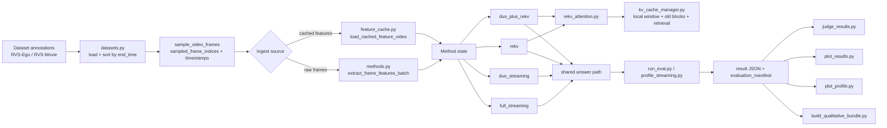
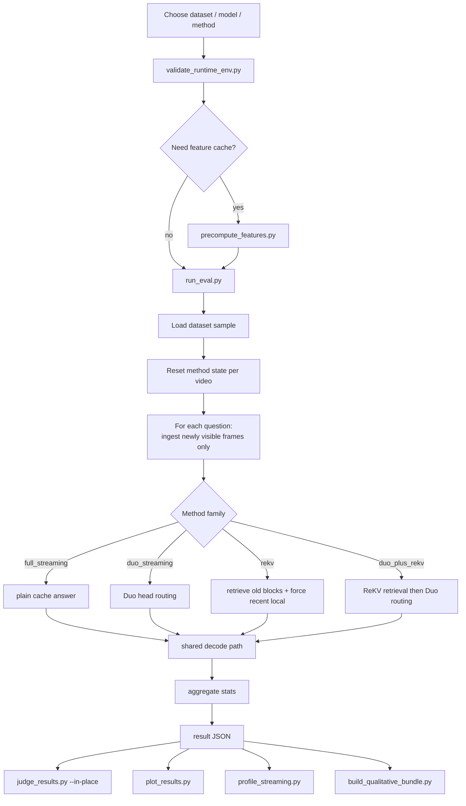

# ReKV + Duo Streaming Guide

This is the working reference for the `streaming/ReKV` lane.

It is meant to answer four questions clearly:
- what the streaming contract is
- how each component is wired
- what each method is actually doing
- how to run and interpret the stack on the current `exp/amd-gpu-inference` branch

The main files behind this guide are:
- [prompt.txt](/workspace/streaming-vqa/streaming/ReKV/prompt.txt)
- [run_eval.py](/workspace/streaming-vqa/streaming/ReKV/run_eval.py)
- [profile_streaming.py](/workspace/streaming-vqa/streaming/ReKV/profile_streaming.py)
- [methods.py](/workspace/streaming-vqa/streaming/ReKV/methods.py)
- [datasets.py](/workspace/streaming-vqa/streaming/ReKV/datasets.py)
- [feature_cache.py](/workspace/streaming-vqa/streaming/ReKV/feature_cache.py)
- [precompute_features.py](/workspace/streaming-vqa/streaming/ReKV/precompute_features.py)
- [rekv_attention.py](/workspace/streaming-vqa/streaming/ReKV/rekv_core/attention/rekv_attention.py)
- [kv_cache_manager.py](/workspace/streaming-vqa/streaming/ReKV/rekv_core/attention/kv_cache_manager.py)
- [validate_runtime_env.py](/workspace/streaming-vqa/streaming/ReKV/validate_runtime_env.py)

## 1. Executive Summary

The active streaming comparison lane evaluates four methods on causal video QA:
- `full_streaming`
- `duo_streaming`
- `rekv`
- `duo_plus_rekv`

The core flow is:
1. load an RVS dataset
2. sample frames causally at a fixed FPS
3. optionally reuse a validated feature cache
4. ingest only frames strictly before each question `end_time`
5. answer with one of the four methods
6. write a result JSON with an `evaluation_manifest`
7. judge, plot, profile, and inspect qualitative outputs from those JSONs

The branch is now set up to preserve the ROCm portability work while still
tracking the original NVIDIA-first upstream design.

This matters because the original upstream ideas were NVIDIA-first:
- the official ReKV paper/repo is built and evaluated on CUDA with multi-GPU NVIDIA hardware
- the official DuoAttention paper/repo is built around CUDA, `flash-attn`, `flashinfer`, and Block-Sparse-Attention
- this `exp/amd-gpu-inference` workstream is the porting/adaptation branch, not the historical baseline

One concrete flow bug was corrected in this pass:
- the manifest now records question ordering as `dataset_loader_sorted_by_end_time`, which matches the actual loader behavior in [datasets.py](/workspace/streaming-vqa/streaming/ReKV/datasets.py)

## 2. Verified Streaming Contract

This lane is only meaningful if all methods obey the same causal rules.

The current contract is:
- only sampled frames with timestamps strictly earlier than the question `end_time` are visible
- frames are ingested one sampled frame per forward pass
- method state is reused across questions from the same video
- there is no offline whole-video prefill
- all methods must share the same sampled-frame schedule
- if feature cache is used, the cache schedule must exactly match the run schedule

The contract is recorded in the `evaluation_manifest` produced by [run_eval.py](/workspace/streaming-vqa/streaming/ReKV/run_eval.py).

The important implementation points are:
- [datasets.py](/workspace/streaming-vqa/streaming/ReKV/datasets.py) sorts conversations by `end_time`
- [run_eval.py](/workspace/streaming-vqa/streaming/ReKV/run_eval.py) uses `conversation_target_frame_count(...)` with `bisect_left(...)`
- `bisect_left(...)` means visibility is strictly before `end_time`, not `<= end_time`

## 3. End-to-End Architecture

## 4. Workflow Diagram

## 5. Component-by-Component Verification

### 5.1 Dataset loading and conversation order

File:
- [datasets.py](/workspace/streaming-vqa/streaming/ReKV/datasets.py)

Verified behavior:
- supports `rvs_ego` and `rvs_movie`
- resolves annotations either from explicit paths or Hugging Face
- resolves videos from local roots or Hugging Face download candidates
- sorts each video's conversations by `end_time`
- normalizes each conversation into a `StreamingConversation`

Important note:
- the loader does not sort by `start_time`
- the manifest was updated to match this exact behavior

### 5.2 Frame sampling

Files:
- [datasets.py](/workspace/streaming-vqa/streaming/ReKV/datasets.py)
- [run_eval.py](/workspace/streaming-vqa/streaming/ReKV/run_eval.py)

Verified behavior:
- sampling happens at `sample_fps`
- the sampled schedule is represented as:
  - `sampled_frame_indices`
  - `sampled_timestamps_sec`
- question visibility is computed from sampled timestamps, not source-frame timestamps

This is the fairness anchor for cross-method comparison.

### 5.3 Feature cache

Files:
- [precompute_features.py](/workspace/streaming-vqa/streaming/ReKV/precompute_features.py)
- [feature_cache.py](/workspace/streaming-vqa/streaming/ReKV/feature_cache.py)

Verified behavior:
- `precompute_features.py` extracts visual features using the same model family as eval
- cache files store:
  - schedule metadata
  - frame/timestamp metadata
  - per-frame feature tensors
- `validate_feature_cache_payload(...)` checks:
  - sample ID
  - video ID
  - sample FPS
  - expected frame schedule
  - expected timestamp schedule
  - tensor shape consistency

Meaning:
- the cache is not just a speed optimization
- it is also a comparison-safety mechanism

### 5.4 Main evaluation loop

File:
- [run_eval.py](/workspace/streaming-vqa/streaming/ReKV/run_eval.py)

Verified behavior:
- builds a normalized `run_config`
- validates comparison-critical settings
- loads dataset samples
- optionally validates feature-cache compatibility
- instantiates the selected method
- resets once per video
- ingests only newly visible frames before each question
- records per-question and aggregate metrics
- writes `evaluation_manifest`
- supports resume with config-compatibility checks

Important manifest sections:
- `shared_run_settings`
- `streaming_protocol`
- `method_manifest`
- `feature_cache_manifest`

### 5.5 Shared answer path

File:
- [methods.py](/workspace/streaming-vqa/streaming/ReKV/methods.py)

Verified behavior:
- all methods share the same init/system prompt prefix
- all methods use the same question prompt helper
- all methods decode through the same greedy decode loop
- method differences are isolated to:
  - how frame tokens are ingested
  - what cache is assembled for answer-time prefill

This was one of the biggest correctness improvements in the lane.

### 5.6 `full_streaming`

File:
- [methods.py](/workspace/streaming-vqa/streaming/ReKV/methods.py)

Behavior:
- plain causal KV cache
- no retrieval
- no Duo routing

Manifest label:
- `plain_full_streaming_cache`

### 5.7 `duo_streaming`

Files:
- [methods.py](/workspace/streaming-vqa/streaming/ReKV/methods.py)
- [duo_attn/patch/streaming_attn.py](/workspace/streaming-vqa/duo_attn/patch/streaming_attn.py)

Behavior:
- loads learned Duo head routing from `attn_dir`
- enables Duo eval mode on the model
- keeps Duo sink/recent deployment windows
- records actual backend resolution, not just requested backend

Manifest labels:
- `duo_tuple_kv_compressed_streaming`
- `result_interpretation_category`

Important nuance:
- on CUDA with `block_sparse_attn` available, this can be close to native Duo deployment intent
- on ROCm or any environment without that kernel, it degrades to an explicitly labeled baseline

### 5.8 `rekv`

Files:
- [methods.py](/workspace/streaming-vqa/streaming/ReKV/methods.py)
- [rekv_attention.py](/workspace/streaming-vqa/streaming/ReKV/rekv_core/attention/rekv_attention.py)
- [kv_cache_manager.py](/workspace/streaming-vqa/streaming/ReKV/rekv_core/attention/kv_cache_manager.py)

Behavior:
- keeps a local GPU window
- offloads older blocks
- scores old blocks for retrieval at answer time
- assembles answer-time context as:
  - init tokens
  - retrieved old blocks
  - forced local recent window

Manifest label:
- `rekv_init_retrieved_old_forced_local`

Current trust level:
- this remains the main method to trust and extend in this repo

### 5.9 `duo_plus_rekv`

Files:
- [methods.py](/workspace/streaming-vqa/streaming/ReKV/methods.py)
- [rekv_attention.py](/workspace/streaming-vqa/streaming/ReKV/rekv_core/attention/rekv_attention.py)
- [kv_cache_manager.py](/workspace/streaming-vqa/streaming/ReKV/rekv_core/attention/kv_cache_manager.py)

Behavior:
- ReKV still owns retrieval and context assembly
- Duo head routing is applied over the assembled ReKV answer context

Manifest labels:
- `hybrid_rekv_context_plus_duo_head_routing`
- `approximate_duo_over_rekv_context`

Interpretation:
- this is intentionally approximate
- it is not the literal standalone Duo tuple-cache algorithm

### 5.10 ReKV cache manager fix that matters

File:
- [kv_cache_manager.py](/workspace/streaming-vqa/streaming/ReKV/rekv_core/attention/kv_cache_manager.py)

Verified behavior:
- early short-probe retrieval no longer assumes enough tokens exist to fill `n_init`
- retrieval can safely return an empty old-block set when only the init region exists

Why it matters:
- this prevents `duo_plus_rekv` profiling/eval failures on short probe horizons
- profiling now works from very small frame counts upward

### 5.11 Runtime and backend reporting

Files:
- [methods.py](/workspace/streaming-vqa/streaming/ReKV/methods.py)
- [validate_runtime_env.py](/workspace/streaming-vqa/streaming/ReKV/validate_runtime_env.py)

Verified behavior:
- runtime metadata now records actual backend resolution
- Duo methods record:
  - `full_attn_backend_actual`
  - `streaming_attn_backend_requested`
  - `streaming_attn_backend_actual`
  - `streaming_attn_fallback_reason`
  - `rope_backend_actual`
  - `rmsnorm_backend_actual`
  - availability flags for `flash_attn`, `flashinfer`, `block_sparse_attn`
- ReKV methods record requested vs actual dot-product backend
- Duo methods support `--duo-strict-no-sdpa-fallback`

That means results can now be interpreted honestly by backend regime.

## 6. Runtime Policy on This Branch

This branch is aimed at AMD / ROCm validation while preserving source alignment
with the original NVIDIA repos.

The current intended runtime policy is:
- default Python environment: `/opt/venv`
- default GPU execution path: local MI300X / ROCm-first validation
- default backend check: `python -m streaming.ReKV.validate_rocm_env`

Relevant entrypoints:
- [scripts/streaming_env.sh](/workspace/streaming-vqa/scripts/streaming_env.sh)
- [streaming/ReKV/run_eval.sh](/workspace/streaming-vqa/streaming/ReKV/run_eval.sh)
- [streaming/ReKV/profile_streaming.sh](/workspace/streaming-vqa/streaming/ReKV/profile_streaming.sh)
- [scripts/run_streaming_smoke.sh](/workspace/streaming-vqa/scripts/run_streaming_smoke.sh)

Current behavior:
- local launchers now use a shared env helper
- the helper prefers ROCm automatically on AMD hosts
- ROCm-specific scripts can still request `/opt/venv` explicitly
- SLURM now has real `run_eval.sh` and `profile_streaming.sh` wrappers instead of a missing entrypoint
- `run_eval.py` now supports ReKV-style dataset sharding with `--num-chunks` and `--chunk-index`
- [run_streaming_eval_slurm_array.sh](/workspace/streaming-vqa/scripts/run_streaming_eval_slurm_array.sh) provides a simple SLURM array worker for multi-GPU evaluation

## 6.1 Official Source Alignment

The official upstream references are:
- ReKV paper: https://arxiv.org/abs/2503.00540
- ReKV repo: https://github.com/Becomebright/ReKV
- DuoAttention paper: https://arxiv.org/abs/2410.10819
- DuoAttention repo: https://github.com/mit-han-lab/duo-attention

The key upstream facts to keep in mind are:
- ReKV explicitly frames itself as separating video analysis and question answering across different processes and GPUs
- the official ReKV repo documents setup on Ubuntu 22.04, CUDA 12.6, and `8x Nvidia H800 (80GB)`, and its eval entrypoint uses `--num_chunks`
- the official Duo repo installs `pytorch-cuda`, `flash-attn`, `flashinfer`, and Block-Sparse-Attention, and demonstrates single-A100 CUDA inference

So for this branch:
- NVIDIA/CUDA should still be treated as the native upstream target
- AMD support remains useful as the portability branch
- native Duo sparse kernels and cluster sharding remain important reference points even when this branch falls back on ROCm

## 7. Backend Interpretation Rules

### 7.1 ROCm / AMD

This branch is the main place to keep the ROCm fallback story explicit and honest.

Typical current behavior on MI300X:
- `accelerator_backend = rocm`
- `flash_attn` available
- `block_sparse_attn` unavailable
- Duo streaming attention resolves to SDPA fallback unless a native sparse path exists

Recommended validation:
1. run `python -m streaming.ReKV.validate_rocm_env`
2. inspect `streaming_attn_backend_actual`
3. keep Duo results labeled as fallback baselines when SDPA is active

### 7.2 NVIDIA / CUDA

Expected behavior on the target cluster:
- `accelerator_backend = cuda`
- Duo can use native sparse streaming only if `block_sparse_attn` is actually installed and resolves successfully
- TF32 is enabled by default in [run_eval.py](/workspace/streaming-vqa/streaming/ReKV/run_eval.py)
- `torch.compile` is opt-in on CUDA via `PYTORCH_COMPILE=1`

Recommended validation:
1. run `python -m streaming.ReKV.validate_runtime_env`
2. inspect `streaming_attn_backend_actual`
3. use `--duo-strict-no-sdpa-fallback` when you want to guarantee native sparse Duo behavior
4. when evaluating at scale, shard runs across GPUs with `--num-chunks` / `--chunk-index` or the SLURM array worker

### 7.3 Why backend labels matter

The same method name can represent different kernel regimes.

Examples:
- `duo_streaming` with true block-sparse streaming on CUDA
- `duo_streaming` with SDPA fallback on ROCm

Those should not be described as equivalent results.

## 8. Verified Tooling Flow

The intended practical workflow is now:

1. Validate runtime:
   `python -m streaming.ReKV.validate_rocm_env`
2. Optionally precompute features:
   `python -m streaming.ReKV.precompute_features ...`
3. Run eval:
   `python -m streaming.ReKV.run_eval ...`
   or use the AMD/local launcher scripts
4. Judge:
   `python -m streaming.ReKV.judge_results --in-place ...`
5. Plot:
   `python -m streaming.ReKV.plot_results ...`
6. Profile:
   `python -m streaming.ReKV.profile_streaming ...`
   or use the AMD/local profile launcher

Supporting launcher scripts:
- [run_streaming_full_eval_local.sh](/workspace/streaming-vqa/scripts/run_streaming_full_eval_local.sh)
- [run_streaming_profile_local.sh](/workspace/streaming-vqa/scripts/run_streaming_profile_local.sh)
- [run_streaming_subsample5_local.sh](/workspace/streaming-vqa/scripts/run_streaming_subsample5_local.sh)
- [run_streaming_subsample_matrix_local.sh](/workspace/streaming-vqa/scripts/run_streaming_subsample_matrix_local.sh)

## 9. Current Results Story

Retained result trees:
- [rvs-movie/full_eval_topk64_memavg](/workspace/streaming-vqa/outputs/evaluations_streaming/rvs-movie/full_eval_topk64_memavg)
- [rvs-ego/full_eval_topk64_memavg](/workspace/streaming-vqa/outputs/evaluations_streaming/rvs-ego/full_eval_topk64_memavg)

Audited subset trees:
- [rvs-movie/audit_firstq5](/workspace/streaming-vqa/outputs/evaluations_streaming/rvs-movie/audit_firstq5)
- [rvs-ego/audit_firstq5](/workspace/streaming-vqa/outputs/evaluations_streaming/rvs-ego/audit_firstq5)

The current conservative interpretation is still:
- `rekv` is the strongest default method to trust
- `duo_plus_rekv` is now a fairer and better-instrumented comparison
- the retained results do not show a clear default hybrid win over native `rekv`
- ReKV-based methods still offer the strongest memory-efficiency story in the retained full evals

## 10. Paper Alignment

For reporting:
- `rekv` is close enough to ReKV paper intent to be treated as the main paper-aligned baseline here
- `duo_streaming` is paper-aligned only when the native sparse streaming backend is truly active
- `duo_plus_rekv` is a multimodal hybrid approximation, not a literal paper reproduction

## 11. Things That Were Wrong Before, and What Is Better Now

Previously wrong or unclear:
- manifest question ordering text did not match the actual loader sort
- environment policy drifted between `/opt/venv` and `duo`
- SLURM smoke submission referenced a missing wrapper
- backend availability and backend resolution were easy to confuse
- the branch narrative underweighted that the original papers/repos are NVIDIA-first and that AMD was a later porting path

Current status:
- manifest order text matches the loader
- branch defaults are now ROCm-friendly on AMD hosts
- SLURM wrappers exist
- backend resolution is explicit in manifests, validation output, and method stats
- the docs now treat NVIDIA/CUDA as the native baseline and AMD as the portability branch

## 12. One-Screen Mental Model

If you want the shortest correct summary:

- `full_streaming` is the plain streaming baseline
- `duo_streaming` applies Duo routing and may or may not have native sparse streaming depending on backend resolution
- `rekv` keeps recent context live, offloads older blocks, and retrieves relevant old blocks at question time
- `duo_plus_rekv` first uses ReKV to build answer-time context, then applies Duo routing on top
- on this branch, validate backend reality first, then interpret results
