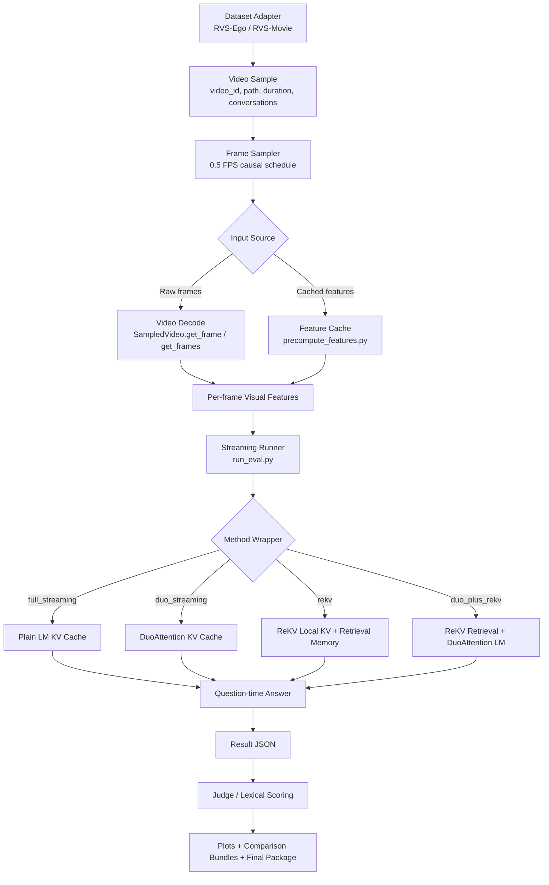
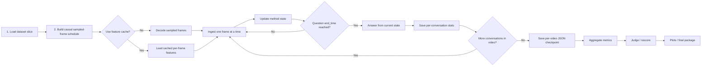

# ReKV vs DuoAttention

## TL;DR
- Goal: evaluate streaming `DuoAttention`, `ReKV`, and `DuoAttention + ReKV` for streaming VideoQA on `LLaVA-OneVision 0.5B`.
- Hardware assumption: NVIDIA CUDA GPUs with the upstream DuoAttention CUDA stack available.
- Streaming semantics used throughout:
  - causal frame ingest
  - one sampled frame per forward pass
  - shared state across questions in the same video
  - no offline full-video prefill
  - no LongBench-style tail replay
- Current promoted hybrid:
  - `duo_plus_rekv`
  - `sparsity = 0.375`
  - `retrieve_size = 64`
  - `n_local = 15000`
- Current strongest overall standalone method on the validated subsamples: `rekv`
- Current status:
  - subsample-only evaluation is complete and packaged
  - optimized full-eval workflow is implemented
  - full-dataset runs are ready but have not been executed end to end yet

## What This Project Is
We are comparing four streaming inference strategies on long-video streaming QA:

| Method | Idea |
| --- | --- |
| `full_streaming` | plain streaming baseline with no DuoAttention and no ReKV |
| `duo_streaming` | same streaming runner, but decoder attention uses DuoAttention |
| `rekv` | same streaming runner, but long-range memory is handled by ReKV retrieval |
| `duo_plus_rekv` | ReKV retrieval plus DuoAttention only in the post-retrieval LM attention path |

This project is deliberately about **streaming** behavior, so the runner never assumes the whole video is known in advance.

## Streaming Basics

### How the stream is processed
For each video:
1. Sample frames at `0.5 FPS`.
2. Ingest sampled frames causally, one frame at a time.
3. When a question arrives at time `t`, only sampled frames with `timestamp < t` are available.
4. Answer from the method’s current state.

### What “current state” means
- `full_streaming` / `duo_streaming`: the live decoder KV cache after all frames seen so far.
- `rekv`: live KV cache plus ReKV’s retained retrievable memory.
- `duo_plus_rekv`: same ReKV retrieval state, then DuoAttention in the answer-time LM path.

### A+B meaning in this repo
`duo_plus_rekv` is intentionally implemented as:
- retrieval policy = **native ReKV**
- answer attention policy = **DuoAttention post-retrieval**

That means Duo does **not** interfere with ReKV’s retrieval selection.

## Repo Map

### Main code
- [run_eval.py](/workspace/streaming-vqa/streaming/ReKV/run_eval.py): main streaming runner
- [datasets.py](/workspace/streaming-vqa/streaming/ReKV/datasets.py): `RVS-Ego` / `RVS-Movie` dataset adapters and sampling
- [methods.py](/workspace/streaming-vqa/streaming/ReKV/methods.py): `full_streaming`, `duo_streaming`, `rekv`, `duo_plus_rekv`
- [feature_cache.py](/workspace/streaming-vqa/streaming/ReKV/feature_cache.py): strict feature-cache metadata/load helpers
- [precompute_features.py](/workspace/streaming-vqa/streaming/ReKV/precompute_features.py): precompute shared frame features
- [judge_results.py](/workspace/streaming-vqa/streaming/ReKV/judge_results.py): post-hoc local judge rescoring
- [plot_results.py](/workspace/streaming-vqa/streaming/ReKV/plot_results.py): plot generation
- [compare_subsamples.py](/workspace/streaming-vqa/streaming/ReKV/compare_subsamples.py): cross-slice comparisons

### Local launchers
- [run_streaming_subsample5_local.sh](/workspace/streaming-vqa/scripts/run_streaming_subsample5_local.sh): subsample runs
- [run_streaming_full_eval_local.sh](/workspace/streaming-vqa/scripts/run_streaming_full_eval_local.sh): optimized local full eval

## Architecture Diagram



## Workflow Diagram

Diagram status:
- No architecture-diagram change is required after the causality review.
- The only clarification is that question-time availability is defined by sampled timestamps
  (`timestamp < end_time`), not by a rounded FPS formula.



## Method Architecture

```text
full_streaming
  sampled frames -> visual features -> LM KV cache -> answer

duo_streaming
  sampled frames -> visual features -> DuoAttention LM KV cache -> answer

rekv
  sampled frames -> visual features -> local KV + retrievable memory
  question -> ReKV retrieval -> answer

duo_plus_rekv
  sampled frames -> visual features -> local KV + retrievable memory
  question -> native ReKV retrieval -> DuoAttention answer-time LM
```

## Mental Model Diagram

```text
1. duo_streaming

video stream
  -> per-frame visual features
  -> live decoder attention over the stream
     - some heads keep long-range access
     - some heads use sink + recent window
  -> answer

Key idea:
  Keep streaming context live, but make attention cheaper.


2. rekv

video stream
  -> per-frame visual features
  -> local live KV + retrievable long-range memory
  -> question arrives
  -> retrieve a small relevant subset of old context
  -> answer

Key idea:
  Do not keep all old context live; retrieve what matters at question time.


3. duo_plus_rekv

video stream
  -> per-frame visual features
  -> local live KV + retrievable long-range memory
  -> question arrives
  -> native ReKV retrieval picks the relevant old context
  -> DuoAttention runs on the reduced answer-time LM context
  -> answer

Key idea:
  ReKV solves long-range memory first, then DuoAttention tries to make the
  remaining answer-time attention cheaper.
```

## What Was Implemented

### Core streaming pipeline
- Added normalized dataset adapters for:
  - `RVS-Ego`
  - `RVS-Movie`
- Added a causal streaming runner with:
  - atomic JSON checkpoints
  - `--resume`
  - `--overwrite-output`
  - `--flush-every-videos`
  - deterministic `--video-offset`
  - per-video progress output

### Methods
- Added:
  - `full_streaming`
  - `duo_streaming`
  - `rekv`
  - `duo_plus_rekv`

### Evaluation and reporting
- Added:
  - lexical open-ended scoring bundle
  - local LLM-judge rescoring
  - per-slice plots
  - cross-slice comparison bundles
  - curated final package under `outputs/evaluations_streaming/final_subsample_package/`

### Safe full-eval optimization
- Added a shared feature-cache workflow so visual features can be computed once and reused across methods.
- Kept the comparison paper-safe by ensuring:
  - same sampled timestamps
  - same one-frame-per-forward LM ingest
  - same answer-time semantics

## Important Fixes

### 1. Streaming causality fix
- File: [run_eval.py](/workspace/streaming-vqa/streaming/ReKV/run_eval.py)
- Issue: one extra sampled frame was being ingested at question time.
- Intermediate fix: upstream-style exclusive cutoff using `int(end_time * sample_fps)`.
- Final fix after boundary review: use the actual sampled timestamps and ingest exactly
  the frames with `timestamp < end_time`.
- Reason: `int(end_time * sample_fps)` can still under-ingest by one frame when the
  sampled schedule starts at `t=0` and `end_time` falls between sample-grid points.

### 2. ReKV + Duo integration fix
- File: [rekv_attention.py](/workspace/streaming-vqa/streaming/ReKV/rekv_core/attention/rekv_attention.py)
- Fixes:
  - CUDA-native grouped-query attention in the full-attention path
  - Duo disabled during ReKV retrieval selection
  - Duo only applied after retrieval

### 3. Feature-cache implementation
- CUDA precompute batches sampled frames through the vision tower.
- The saved cache still stores per-frame feature tensors on disk.
- All methods reuse the same cached features, so downstream method comparisons stay aligned.

## Datasets and Official Protocol

### Datasets
- `RVS-Ego`
  - 10 videos
  - 1465 QA conversations
- `RVS-Movie`
  - 22 videos
  - 1905 QA conversations
- Total
  - 32 videos
  - 3370 QA conversations

### Official validated subsample slices
- `RVS-Ego subsample5`
- `RVS-Ego subsample5_offset5`
- `RVS-Movie subsample5_movie`
- `RVS-Movie subsample5_movie_offset5`

### Official subsample protocol
- `5` videos
- `3` conversations per video
- `0.5 FPS`
- `seed = 42`
- offset-based slices for stability checks

### Official comparison set
- Main set:
  - `full_streaming`
  - `duo_streaming (s=0.5)`
  - `rekv`
  - `duo_plus_rekv (s=0.375)`
- Ablation-only:
  - `duo_streaming (s=0.0)`

## Main Results

Important provenance note:
- The promoted A+B setting is `duo_plus_rekv (s=0.375)`.
- The checked-in promoted `RVS-Movie` A+B subsample JSONs already match that setting.
- Some older checked-in `RVS-Ego` A+B subsample JSONs still use `s=0.5` and should be
  treated as legacy artifacts rather than the promoted package.
- For any fresh subsample rerun, use
  [run_streaming_subsample5_local.sh](/workspace/streaming-vqa/scripts/run_streaming_subsample5_local.sh),
  which now launches A+B with `s=0.375`.

### RVS-Ego
| Slice | Method | Judge | ROUGE-L F1 | Token F1 | Latency (s) | Peak Mem (GiB) |
| --- | --- | ---: | ---: | ---: | ---: | ---: |
| `subsample5` | `full_streaming` | 0.7733 | 0.1843 | 0.1864 | 1.5985 | 4.8063 |
| `subsample5` | `duo_streaming (s=0.5)` | 0.7733 | 0.2049 | 0.2125 | 1.3657 | 3.3794 |
| `subsample5` | `rekv` | 0.7733 | 0.1918 | 0.2129 | 0.9185 | 2.6685 |
| `subsample5` | `duo_plus_rekv (s=0.375)` | 0.7733 | 0.2152 | 0.2323 | 0.9171 | 2.6583 |
| `subsample5_offset5` | `full_streaming` | 0.7867 | 0.2070 | 0.2316 | 1.6042 | 4.8037 |
| `subsample5_offset5` | `duo_streaming (s=0.5)` | 0.7733 | 0.2182 | 0.2493 | 1.8828 | 3.3793 |
| `subsample5_offset5` | `rekv` | 0.8000 | 0.2023 | 0.2309 | 1.2583 | 2.6671 |
| `subsample5_offset5` | `duo_plus_rekv (s=0.375)` | 0.7867 | 0.2063 | 0.2284 | 1.3055 | 2.6580 |

### RVS-Movie
| Slice | Method | Judge | ROUGE-L F1 | Token F1 | Latency (s) | Peak Mem (GiB) |
| --- | --- | ---: | ---: | ---: | ---: | ---: |
| `subsample5_movie` | `full_streaming` | 0.8000 | 0.0791 | 0.0981 | 1.7508 | 3.9774 |
| `subsample5_movie` | `duo_streaming (s=0.5)` | 0.7867 | 0.0890 | 0.1085 | 2.1885 | 2.9366 |
| `subsample5_movie` | `rekv` | 0.8000 | 0.0928 | 0.1019 | 1.3106 | 2.7909 |
| `subsample5_movie` | `duo_plus_rekv (s=0.375)` | 0.7867 | 0.0941 | 0.0989 | 1.6461 | 2.7816 |
| `subsample5_movie_offset5` | `full_streaming` | 0.7733 | 0.1126 | 0.1340 | 3.7262 | 6.4201 |
| `subsample5_movie_offset5` | `duo_streaming (s=0.5)` | 0.7867 | 0.1214 | 0.1341 | 3.9888 | 4.2483 |
| `subsample5_movie_offset5` | `rekv` | 0.8000 | 0.1289 | 0.1488 | 1.3319 | 2.6896 |
| `subsample5_movie_offset5` | `duo_plus_rekv (s=0.375)` | 0.8000 | 0.1300 | 0.1455 | 1.4921 | 2.6804 |

## What the Current Results Support
- `rekv` is the most consistently strong method across the four validated subsample slices.
- `duo_streaming (s=0.5)` is a meaningful streaming baseline and often lowers memory relative to `full_streaming`, but the quality-latency tradeoff is dataset-dependent.
- `duo_plus_rekv (s=0.375)` is a valid hybrid and sometimes matches or nearly matches `rekv`, but it is not yet a universal improvement over plain `rekv`.

## Qualitative Findings
- `duo_streaming` helped most when `full_streaming` over-interpreted scenes and hallucinated stronger events than the visuals supported.
- `rekv` tended to beat `duo_plus_rekv` when the hybrid became too generic or hedgey.
- The local judge is useful, but still coarse enough that qualitative inspection matters.

Best qualitative artifact:
- [qualitative_examples.md](/workspace/streaming-vqa/outputs/evaluations_streaming/final_subsample_package/qualitative_examples.md)

## Plot Guide

### Existing core plots
- `aggregate_comparison.png`
  - high-level per-slice comparison of quality, TTFT, answer latency, and frame-ingest latency
- `peak_memory_comparison.png`
  - direct peak-memory comparison across methods
- `quality_latency_tradeoff.png`
  - raw quality vs latency operating points
- `quality_memory_tradeoff.png`
  - raw quality vs memory operating points
- `per_conversation_metrics.png`
  - how frames ingested, TTFT, and answer latency vary over conversations inside one slice
- `efficiency_vs_context.png`
  - how latency and memory change as more frames have been processed
- `quality_vs_context.png`
  - whether quality degrades or improves later in the stream
- `question_timeline.png`
  - sanity-check that frame ingest grows causally with question time
- `rekv_retrieval_diagnostics.png`
  - ReKV-only retrieval latency and retrieved-block behavior

### New decision-focused plots
- `delta_to_baseline.png`
  - shows whether Duo helps or hurts relative to its intended baseline
  - `duo_streaming` is measured against `full_streaming`
  - `duo_plus_rekv` is measured against `rekv`
  - includes quality delta, answer-latency delta, and peak-memory delta
- `pareto_tradeoffs_with_arrows.png`
  - shows quality vs latency and quality vs memory in one figure
  - dashed arrows show the directional move from:
    - `full_streaming -> duo_streaming`
    - `rekv -> duo_plus_rekv`
  - this is the clearest “does Duo move the operating point in a useful direction?” plot
- `delta_stability.png`
  - cross-subsample stability of Duo’s effect, not just raw method scores
  - tracks:
    - `duo_streaming - full_streaming`
    - `duo_plus_rekv - rekv`
  - includes quality, latency, and memory deltas across the validated slices

## Optimized Full Eval Workflow

### Why the feature cache exists
Without caching, every method recomputes:
- video decode
- vision preprocessing
- vision tower forward
- projector / pooling

The safe optimization is to do that visual work once, save the features, and reuse them across methods.

### Cache validation result
Validated on one real `RVS-Movie` clip (`tt0090756`) with one conversation:
- raw vs cached matched exactly for:
  - `full_streaming`
  - `duo_streaming (s=0.5)`
  - `rekv`
  - `duo_plus_rekv (s=0.375)`
- ReKV retrieval stats also matched exactly.

Short-clip wall times:
- `full_streaming`: `7.63s -> 6.96s`
- `duo_streaming`: `7.92s -> 7.44s`
- `rekv`: `8.41s -> 7.85s`
- `duo_plus_rekv`: `8.39s -> 7.86s`

Interpretation:
- the per-method speedup on one short clip is modest
- the bigger win should come from reusing one precompute pass across the whole 4-method full run

## How To Run

### Environment
```bash
source /root/miniforge3/etc/profile.d/conda.sh
conda activate duo
```

### Quick environment sanity check
Run the lightweight smoke test first:
```bash
python -m streaming.ReKV.smoke_test
```

If that passes, run a tiny real-data subsample check:
```bash
MAX_VIDEOS=1 MAX_CONVERSATIONS=1 bash scripts/run_streaming_subsample5_local.sh full
MAX_VIDEOS=1 MAX_CONVERSATIONS=1 bash scripts/run_streaming_subsample5_local.sh duo
MAX_VIDEOS=1 MAX_CONVERSATIONS=1 bash scripts/run_streaming_subsample5_local.sh rekv
MAX_VIDEOS=1 MAX_CONVERSATIONS=1 bash scripts/run_streaming_subsample5_local.sh ab
```

What this verifies:
- dataset loading
- frame sampling
- streaming ingest
- DuoAttention path
- ReKV path
- A+B path
- JSON writing

If you want to test the cache workflow too, run:
```bash
DATASET=rvs_ego MAX_VIDEOS=1 bash scripts/run_streaming_full_eval_local.sh precompute
DATASET=rvs_ego MAX_VIDEOS=1 MAX_CONVERSATIONS=1 bash scripts/run_streaming_full_eval_local.sh all
```

### Subsample runs
```bash
bash scripts/run_streaming_subsample5_local.sh all
VIDEO_OFFSET=5 SUBSAMPLE_NAME=subsample5_offset5 bash scripts/run_streaming_subsample5_local.sh all
```

Current promoted subsample settings:
- `duo_streaming`: `s=0.5`
- `rekv`: `retrieve_size=64`, `n_local=15000`
- `duo_plus_rekv`: `s=0.375`, `retrieve_size=64`, `n_local=15000`

### Optimized full eval
Precompute once:
```bash
DATASET=rvs_ego bash scripts/run_streaming_full_eval_local.sh precompute
DATASET=rvs_movie bash scripts/run_streaming_full_eval_local.sh precompute
```

Run official 4-method package:
```bash
DATASET=rvs_ego bash scripts/run_streaming_full_eval_local.sh all
DATASET=rvs_movie bash scripts/run_streaming_full_eval_local.sh all
```

The official full-eval launcher already matches the promoted settings:
- `duo_streaming`: `s=0.5`
- `rekv`: `retrieve_size=64`, `n_local=15000`
- `duo_plus_rekv`: `s=0.375`, `retrieve_size=64`, `n_local=15000`

Run with Duo full-head ablation too:
```bash
DATASET=rvs_ego bash scripts/run_streaming_full_eval_local.sh all_with_control
```

Resume:
```bash
DATASET=rvs_ego RESUME=1 bash scripts/run_streaming_full_eval_local.sh all
DATASET=rvs_movie RESUME=1 bash scripts/run_streaming_full_eval_local.sh all
```

Judge only:
```bash
DATASET=rvs_ego bash scripts/run_streaming_full_eval_local.sh judge
DATASET=rvs_movie bash scripts/run_streaming_full_eval_local.sh judge
```

Run a single method:
```bash
DATASET=rvs_ego bash scripts/run_streaming_full_eval_local.sh rekv
DATASET=rvs_movie bash scripts/run_streaming_full_eval_local.sh ab
```

Optional overrides:
```bash
DATASET=rvs_movie FEATURE_BATCH_SIZE=32 bash scripts/run_streaming_full_eval_local.sh precompute
DATASET=rvs_ego USE_FEATURE_CACHE=0 bash scripts/run_streaming_full_eval_local.sh full
DATASET=rvs_ego FLUSH_EVERY_VIDEOS=5 bash scripts/run_streaming_full_eval_local.sh all
```

### Regenerate plots after a run
Per-slice plots:
```bash
python -m streaming.ReKV.plot_results \
  outputs/evaluations_streaming/rvs-ego/subsample5/full_streaming/full_streaming.json \
  outputs/evaluations_streaming/rvs-ego/subsample5/duo_streaming/duo_streaming_s05.json \
  outputs/evaluations_streaming/rvs-ego/subsample5/rekv/rekv_topk64_nlocal15000.json \
  outputs/evaluations_streaming/rvs-ego/subsample5/duo_plus_rekv/duo_plus_rekv_s0375_topk64_nlocal15000.json \
  --output-dir outputs/evaluations_streaming/rvs-ego/subsample5/main_plots
```

Cross-subsample comparison bundle:
```bash
python -m streaming.ReKV.compare_subsamples \
  outputs/evaluations_streaming/rvs-ego/subsample5/full_streaming/full_streaming.json \
  outputs/evaluations_streaming/rvs-ego/subsample5/duo_streaming/duo_streaming_s05.json \
  outputs/evaluations_streaming/rvs-ego/subsample5/rekv/rekv_topk64_nlocal15000.json \
  outputs/evaluations_streaming/rvs-ego/subsample5/duo_plus_rekv/duo_plus_rekv_s0375_topk64_nlocal15000.json \
  outputs/evaluations_streaming/rvs-ego/subsample5_offset5/full_streaming/full_streaming.json \
  outputs/evaluations_streaming/rvs-ego/subsample5_offset5/duo_streaming/duo_streaming_s05.json \
  outputs/evaluations_streaming/rvs-ego/subsample5_offset5/rekv/rekv_topk64_nlocal15000.json \
  outputs/evaluations_streaming/rvs-ego/subsample5_offset5/duo_plus_rekv/duo_plus_rekv_s0375_topk64_nlocal15000.json \
  --output-dir outputs/evaluations_streaming/rvs-ego/subsample_comparison_offset0_vs_offset5
```

## Output Layout

### Main package to read or push
- [final_subsample_package](/workspace/streaming-vqa/outputs/evaluations_streaming/final_subsample_package)

Best entry points:
- [final_metrics.md](/workspace/streaming-vqa/outputs/evaluations_streaming/final_subsample_package/final_metrics.md)
- [paper_story.md](/workspace/streaming-vqa/outputs/evaluations_streaming/final_subsample_package/paper_story.md)
- [qualitative_examples.md](/workspace/streaming-vqa/outputs/evaluations_streaming/final_subsample_package/qualitative_examples.md)

### Official raw subsample outputs retained
- `outputs/evaluations_streaming/rvs-ego/subsample5/`
- `outputs/evaluations_streaming/rvs-ego/subsample5_offset5/`
- `outputs/evaluations_streaming/rvs-movie/subsample5_movie/`
- `outputs/evaluations_streaming/rvs-movie/subsample5_movie_offset5/`

When reading old raw subsample outputs, always inspect `run_config.sparsity` before
using A+B numbers in writeups.

### Cross-slice bundles retained
- `outputs/evaluations_streaming/rvs-ego/subsample_comparison_offset0_vs_offset5/`
- `outputs/evaluations_streaming/rvs-movie/subsample_comparison_offset0_vs_offset5/`
- `outputs/evaluations_streaming/subsample_only_summary/`

## Cleanup Done
- Removed exploratory smoke-only outputs.
- Removed tuning-only output directories.
- Removed temporary cache-validation raw outputs that were not part of the final story.
- Removed temporary `full_eval` dry-run output.
- Removed Python `__pycache__` clutter from `streaming/ReKV/`.

The output tree is now centered on:
- official subsample outputs
- final curated package
- cross-slice summaries

## What Remains Deferred
- full-dataset evaluation on both datasets
- any further A+B retuning
- stronger external judge if a better scoring path becomes available

## Practical Conclusion
If work resumes later:
1. Start from the optimized full-eval workflow.
2. Keep the official method set to:
   - `full_streaming`
   - `duo_streaming (s=0.5)`
   - `rekv`
   - `duo_plus_rekv (s=0.375)`
3. Use `duo_streaming (s=0.0)` only as an ablation.
4. Use the new delta plots to answer the project question:
   - Does Duo help vs `full_streaming`?
   - Does Duo help when added on top of `rekv`?
   - Is that effect stable across subsamples?
