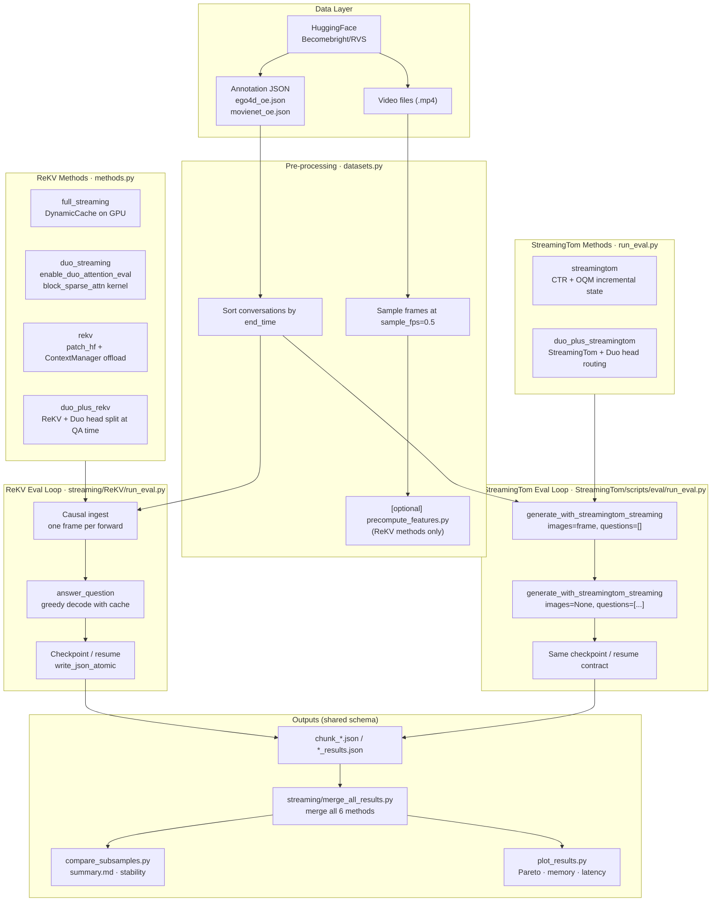
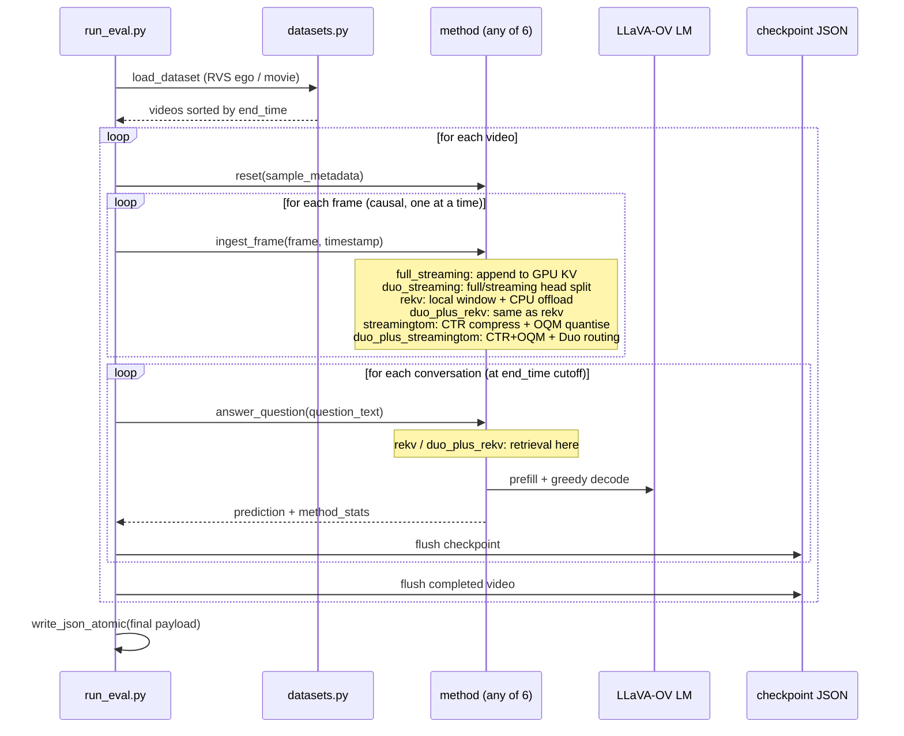
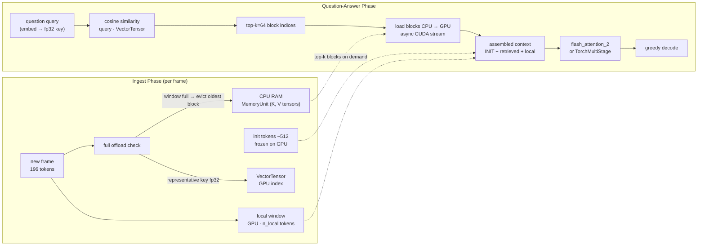
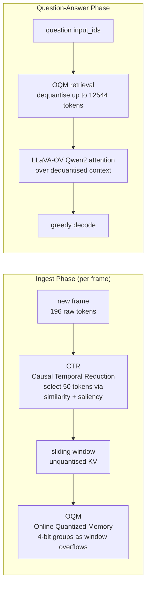
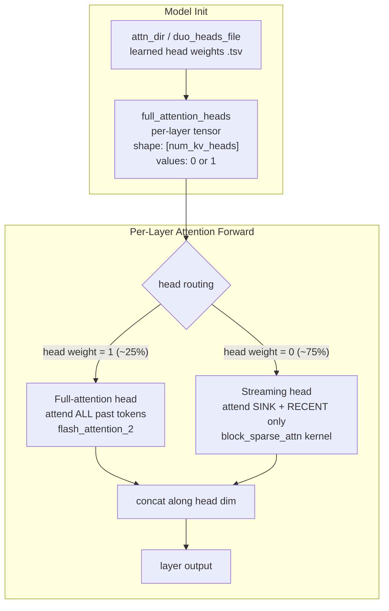
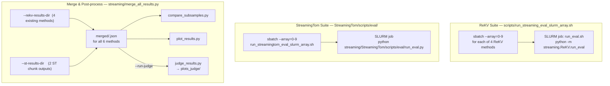

# Streaming Video-QA — All 6 Methods: ReKV + DuoAttention + StreamingTom

Unified reference for all streaming video-QA evaluation methods in this project.

**Cluster:** NVIDIA SLURM · RTX A6000 GPUs (48 GB VRAM) · CUDA
**Repo:** `/w/nobackup/385/scratch-space/expires-2026-Apr-23/navy/streaming-vqa`
**Branch:** `exp/streamingtom-eval-lat`

---

## 1. What This Project Does

We evaluate **six streaming video-QA methods** on the **RVS benchmark** (ego-centric 60-min
videos and movie clips). Each method ingests video frames causally — one sampled frame at a
time — and answers open-ended questions about what it saw, without any offline whole-video
prefill. Methods differ only in how they manage the growing KV cache and whether they
compress, offload, or retrieve past context.

**Primary goal:** compare quality (judge score + ROUGE-L F1), answer latency, and GPU/CPU
memory across all six methods as video length scales.

---

## 2. The Six Methods

### 2.1 ReKV suite (methods 1–4, `envs/duo`)

| Method | Cache strategy | Memory model |
|---|---|---|
| `full_streaming` | Plain causal KV cache; all frame tokens kept on GPU | Grows linearly (~9 GB movie / ~15 GB ego 60-min) |
| `duo_streaming` | Duo head routing: 25% full-attn heads (all tokens) + 75% streaming heads (sink+recent window) | Bounded GPU RAM; no CPU offload; needs `block_sparse_attn` |
| `rekv` | Local GPU window + CPU offload of old blocks + cosine-similarity top-k retrieval at QA time | ~3.2 GB GPU + ~2–4 GB CPU |
| `duo_plus_rekv` | ReKV retrieval assembles context, then Duo head routing applied over it | Same as rekv; approximate hybrid |

**Full-dataset results — LLaVA-OV 0.5B, sink=256/recent=512, s=0.75**

RVS-Movie (22 videos, 1905 questions):

| Method | Judge (0–1) | ROUGE-L F1 | Latency (s) | Peak GPU | Peak CPU |
|---|---|---|---|---|---|
| `full_streaming` | 0.767 | 0.140 | 1.34 | 9.2 GB | — |
| `duo_streaming` | **0.777** | 0.123 | **0.33** | 3.5 GB | — |
| `rekv` (topk=64, n_local=15k) | 0.764 | 0.116 | 0.63 | **3.2 GB** | 2.3 GB |
| `duo_plus_rekv` (s=0.75, topk=64) | 0.768 | 0.119 | 0.89 | 3.2 GB | 2.3 GB |

RVS-Ego (10 videos, 60-min each, 1465 questions):

| Method | Judge (0–1) | ROUGE-L F1 | Latency (s) | Peak GPU | Peak CPU |
|---|---|---|---|---|---|
| `full_streaming` | 0.688 | 0.121 | 1.77 | 15.0 GB | — |
| `duo_streaming` | **0.740** | 0.139 | **0.33** | 4.8 GB | — |
| `rekv` (topk=64, n_local=15k) | 0.735 | **0.193** | 0.41 | **3.1 GB** | 4.0 GB |
| `duo_plus_rekv` (s=0.75, topk=64) | 0.737 | 0.190 | 0.59 | 3.1 GB | 4.0 GB |

> **Judge score is the primary quality metric** (LLaVA-OV 0.5B judge, 0–5 scale → 0–1).
> ROUGE-L underestimates paraphrased answers. `duo_streaming` leads on judge even where
> `rekv` leads on ROUGE-L — retrieval helps word overlap, Duo streaming heads capture semantics.

### 2.2 StreamingTom suite (methods 5–6, `envs/duo-st`)

| Method | Cache strategy | Memory model |
|---|---|---|
| `streamingtom` | Native StreamingTom: CTR (token compression) + OQM (4-bit quantized memory) with online retrieval | StreamingTom-managed; ~15.7× KV compression ratio |
| `duo_plus_streamingtom` | StreamingTom runtime + Duo head routing injected into Qwen2 attention forward | StreamingTom memory + per-head full vs. sink/recent routing |

> StreamingTom results are **pending full eval** — only smoke tests have been run so far.
> Once full eval completes, results will be added here and merged with the 4-method table above.

---

## 3. Method Details — Step by Step

### `full_streaming`
1. Load LLaVA-OV with `flash_attention_2` — tiled kernel, never materialises O(seq²)
2. Each frame: full LM forward, append 196 KV tokens to GPU cache
3. KV cache grows linearly — all frames stay resident in VRAM
4. At question: prefill with full accumulated KV, greedy decode
5. **Upper-bound baseline** — attends over every ingested frame; no compression

---

### `duo_streaming` (s=0.75)
1. Load model; `enable_duo_attention_eval` replaces per-layer attention
2. Learned head weights (from `attn_dir` TSV): ~25% are **full-attn heads** (keep all tokens); ~75% are **streaming heads** (keep only sink + recent window)
3. During ingest: full heads accumulate all KV; streaming heads maintain fixed sink+recent, evicting old tokens
4. KV size stays **bounded** regardless of video length
5. At question: full heads attend over all past; streaming heads attend via **blocksparse** CUDA kernel
6. Context outside the streaming window is permanently dropped — no retrieval

*Requires:* `block_sparse_attn` CUDA kernel (compiled against CUDA 12.x in `envs/duo`)

---

### `rekv` (topk=64, n_local=15000)
1. Load model; `patch_hf` replaces every LM attention forward with `rekv_attention_forward`
2. During ingest: last 15,000 tokens stay on GPU; older blocks (196 tokens/frame) **offloaded to CPU RAM** as `MemoryUnit`; compact fp32 key vector per block stays on GPU in `VectorTensor`
3. Init tokens (~512 system-prompt tokens) frozen on GPU permanently
4. At question: cosine similarity between question query and all block key vectors → **top-64 blocks** loaded back from CPU to GPU
5. Assembled context: `[init tokens] + [top-64 retrieved blocks] + [local 15k window]` — full attention
6. Greedy decode reuses assembled KV step-by-step; CPU offload released after each question

*Core:* `rekv_core/attention/rekv_attention.py` + `kv_cache_manager.py`

---

### `duo_plus_rekv` (s=0.75, topk=64)
1. Load model; apply both ReKV `patch_hf` and Duo head weight registration (`rekv_duo_enabled=True`)
2. Ingest: identical to `rekv` — local window on GPU + CPU offload
3. At question: ReKV retrieval assembles `[init] + [top-64] + [local]`
4. Over assembled context: **Duo head routing** — full heads attend over all; streaming heads attend over init + local window via blocksparse kernel
5. `duo_n_init` extended to ensure Duo sink tokens are always in the assembled context

---

### `streamingtom`
1. Load LLaVA-OV (`lmms-lab` variant); apply StreamingTom patch (`streamingtom.main.streamingtom`)
2. Each frame: `generate_with_streamingtom_streaming(images=frame, questions=[])` — CTR compresses to 50 tokens/frame; OQM quantises old groups to 4-bit
3. At question: `generate_with_streamingtom_streaming(images=None, questions=[input_ids])` — OQM dequantises a capped retrieval budget (12,544 tokens) before attention
4. Total KV compression ratio ~15.7× vs. full_streaming
5. StreamingTom manages all internal state; eval wrapper captures latency/memory

*Key env vars:* `CTR_RETAIN_TOKENS=50`, `OQM_RETRIEVAL_MAX_TOKENS=12544`, `OQM_QUANTIZATION_BITS=4`

---

### `duo_plus_streamingtom`
1. Same base model load and StreamingTom patch as `streamingtom`
2. Load Duo head map; sparsify with configured threshold/sparsity
3. Apply Duo layer prep (`_enable_qwen2_layers_duo_attention_eval`); restore StreamingTom attention forward (to preserve CTR/OQM path)
4. Set `duo_enable=True`, `duo_full_attention_heads`, `duo_sink_size`, `duo_recent_size` on each layer's self-attn
5. During inference, a **true hybrid branch** runs inside Qwen2 attention forward when `duo_enable=True`:
   - **full heads:** attend over full KV available to StreamingTom
   - **streaming heads:** attend only over sink+recent window

*Note:* Not the official Duo tuple-KV eval mode — this is a StreamingTom-compatible hybrid that keeps CTR/OQM semantics while applying Duo routing per head.

---

## 4. Architecture & Workflow Diagrams

### 4.1 System Architecture



---

### 4.2 Per-Video Evaluation Flow (shared by all 6 methods)



---

### 4.3 KV Cache Layout — All Six Methods

```mermaid
graph TD
    subgraph FS["1. full_streaming — GPU only"]
        direction LR
        fs_init["INIT"] --- fs_f1["frame 1"] --- fs_f2["frame 2"] --- fs_dots["···"] --- fs_fn["frame N"]
    end

    subgraph DUO["2. duo_streaming — split by head type"]
        direction LR
        duo_full["full-attn heads ~25%\nall frames · GPU\nblock_sparse_attn"] --- duo_stream["streaming heads ~75%\nSINK + RECENT only · GPU\nblock_sparse_attn"]
    end

    subgraph REKV["3. rekv — GPU local + CPU offload"]
        direction LR
        rekv_init["INIT\nGPU"] --- rekv_cpu["old blocks\nCPU RAM"] --- rekv_local["local window\nn_local tokens\nGPU"]
    end

    subgraph DPR["4. duo_plus_rekv — ReKV offload + Duo head split at QA time"]
        direction LR
        dpr_init["INIT\nGPU"] --- dpr_cpu["CPU offload"] --- dpr_ret["top-k retrieved\nGPU at QA time"] --- dpr_loc["local window\nGPU"]
    end

    subgraph STM["5. streamingtom — CTR + OQM quantised state"]
        direction LR
        stm_init["init tokens\nunquantised"] --- stm_win["sliding window\nunquantised"] --- stm_oqm["OQM groups\n4-bit quantised\nretrieved at QA time"]
    end

    subgraph DPS["6. duo_plus_streamingtom — StreamingTom + Duo head routing"]
        direction LR
        dps_stm["StreamingTom state\n(CTR + OQM)"] --- dps_duo["Duo routing\nper-head inside\nQwen2 forward"]
    end
```



---

### 4.4 ReKV Ingest & Retrieval Detail



---

### 4.5 StreamingTom Ingest & Retrieval



---

### 4.6 Duo Head Routing (shared by `duo_streaming`, `duo_plus_rekv`, `duo_plus_streamingtom`)



> For `duo_plus_streamingtom`: Duo routing runs inside StreamingTom's Qwen2 attention forward
> (`modeling_qwen2_revise.py → _hybrid_duo_streamingtom_attention`). StreamingTom's
> CTR/OQM path is preserved; Duo only determines which KV subset each head attends over.

---

### 4.7 SLURM Job Submission & Output Structure



---

## 5. File Map

### Evaluation orchestration

| File | Purpose |
|---|---|
| `streaming/ReKV/run_eval.py` | Main eval loop for 4 ReKV methods — causal ingest, checkpoint/resume, sharding, result JSON |
| `streaming/ReKV/run_eval.sh` | SLURM wrapper for ReKV methods |
| `streaming/StreamingTom/scripts/eval/run_eval.py` | Eval runner for 2 StreamingTom methods (imports loop from ReKV) |
| `streaming/StreamingTom/scripts/eval/run_streamingtom_eval_slurm_array.sh` | SLURM array job for ST methods |
| `streaming/StreamingTom/scripts/eval/run_streamingtom_vs_duo_plus_run2.sh` | Submit + postprocess both ST methods |
| `streaming/StreamingTom/scripts/eval/entry.sh` | Convenience dispatcher for ST eval |

### Method implementations

| File | Contains |
|---|---|
| `streaming/ReKV/methods.py` | `FullStreamingMethod`, `DuoStreamingMethod`, `ReKVStreamingMethod`, `DuoPlusReKVStreamingMethod` |
| `streaming/ReKV/rekv_core/patch.py` | `patch_hf`: replaces HF attention with `rekv_attention_forward` |
| `streaming/ReKV/rekv_core/attention/rekv_attention.py` | ReKV attention forward; Duo hybrid gate |
| `streaming/ReKV/rekv_core/attention/kv_cache_manager.py` | `ContextManager`, `MemoryUnit`, `VectorTensor` — CPU offload engine |
| `streaming/StreamingTom/scripts/eval/run_eval.py` | `StreamingTomMethod` class (both ST and duo+ST) |
| `streaming/StreamingTom/streamingtom/models/llava/modeling_qwen2_revise.py` | `_hybrid_duo_streamingtom_attention` — runtime Duo+ST branch |
| `streaming/StreamingTom/streamingtom/modules/ctr.py` | CTR: Causal Temporal Reduction per-frame token compression |
| `streaming/StreamingTom/streamingtom/modules/oqm.py` | OQM: 4-bit Online Quantized Memory |

### Dataset and feature caching

| File | Purpose |
|---|---|
| `streaming/ReKV/datasets.py` | `RVSDataset`, `SampledVideo`: load annotations, sample frames, decode with decord |
| `streaming/ReKV/feature_cache.py` | Cache/load precomputed visual features (ReKV methods only; ST uses raw frames) |
| `streaming/ReKV/precompute_features.py` | Batch-extract vision encoder features to disk for ReKV methods |

### Shared scoring and schema

| File | Purpose |
|---|---|
| `streaming/ReKV/common.py` | `StreamingVideoSample`, `StreamingConversation`; ROUGE-L, token F1, exact match |
| `streaming/ReKV/run_eval.py` | `normalize_result_payload_schema` — **single source of truth** for canonical JSON schema across all 6 methods |
| `streaming/ReKV/run_eval.py` | `summarize_aggregate_metrics` — aggregate latency/memory/quality over all conversations |

### Merging and analysis

| File | Purpose |
|---|---|
| `streaming/merge_all_results.py` | **Unified 6-method merge**: ReKV single-run / sharded + ST chunks → merged JSONs + comparison + plots |
| `streaming/StreamingTom/scripts/eval/merge_chunks.py` | ST-only chunk merge + postprocess (called by run_streamingtom_vs_duo_plus_run2.sh) |
| `streaming/ReKV/compare_subsamples.py` | Cross-method stability analysis → `summary.md`, `summary.csv`, stability PNGs |
| `streaming/ReKV/plot_results.py` | Paper-style plots: Pareto, memory/latency curves, quality timelines (15 PNGs) |
| `streaming/ReKV/judge_results.py` | LLM-based semantic scoring (0–5 → 0–1, in-place on result JSON) |

### Smoke tests and validation

| File | Purpose |
|---|---|
| `streaming/run_smoke_all_methods.sh` | **Unified smoke test for all 6 methods** (1 video, 1 conv per method; 0.5B model) |
| `streaming/StreamingTom/scripts/eval/run_smoketest_longest_video.sh` | OOM stress smoke: both ST methods on longest rvs-ego video (~60 min, ~1805 frames) |
| `streaming/ReKV/validate_runtime_env.py` | Verify backend stack: flash-attn, blocksparse, flashinfer availability |

---

## 6. Result JSON Schema

All 6 methods emit the same top-level structure. `normalize_result_payload_schema` in
`streaming/ReKV/run_eval.py` is the canonical enforcement point — it fills sentinel `None`
values for optional fields so downstream tools never KeyError.

```
{
  "run_config":          { <CLI args used> },
  "evaluation_manifest": {
    "comparison_contract_version": "v1",
    "shared_run_settings": { dataset, model, sample_fps, max_new_tokens, seed, ... },
    "streaming_protocol": { causal_cutoff_policy, frame_ingest_policy, ... },
    "method_manifest": {
      "method_name", "method_family",
      "backend_resolution": { streaming_attn_backend_actual, result_interpretation_category, ... },
      "rekv_config": { ... }          # rekv / duo_plus_rekv only
      "duo_deploy_config": { ... }    # duo methods only
    }
  },
  "aggregate_metrics": {
    "avg_judge_score",           # primary quality (after judge_results.py)
    "avg_rouge_l_f1",            # secondary quality
    "avg_token_f1",
    "avg_answer_latency_sec",
    "avg_ttft_sec",
    "avg_frame_ingest_latency_sec",
    "avg_retrieval_latency_sec", # rekv / duo_plus_rekv / streamingtom — else null
    "avg_retrieved_block_count", # rekv / duo_plus_rekv / streamingtom — else null
    "peak_memory_bytes",         # peak GPU memory
    "peak_cpu_offload_bytes",    # rekv / duo_plus_rekv — else null
    "total_conversations_answered",
    "total_videos"
  },
  "videos": [
    {
      "sample_id", "video_id", "video_path", "duration",
      "num_sampled_frames_total", "sampled_timestamps_sec_total",
      "conversations": [
        {
          "question", "reference_answer", "prediction",
          "end_time", "num_frames_ingested_before_answer",
          "scores": {
            "rouge_l_f1", "rouge_l_precision", "rouge_l_recall",
            "token_f1", "token_precision", "token_recall",
            "contains_reference", "normalized_exact_match",
            "judge_score",          # null until judge_results.py runs
            "judge_parse_success"   # null until judge_results.py runs
          },
          "method_stats": {
            "method_name", "ttft_sec", "answer_latency_sec",
            "current_memory_bytes", "peak_memory_bytes",
            "cpu_offload_bytes_current",  # null for non-ReKV
            "cpu_offload_bytes_peak",     # null for non-ReKV
            "retrieval_latency_sec",      # null for full_streaming / duo_streaming
            "avg_retrieved_block_count",
            "frames_ingested_so_far",
            "generated_token_count",
            "stop_reason"
          }
        }
      ],
      "runtime_stats": { frames_ingested, avg_frame_ingest_latency_sec, ... }
    }
  ],
  "judge_config": null,        # populated after judge scoring
  "in_progress_video": null    # non-null only during in-progress checkpoint
}
```

---

## 7. Two Conda Environments

| Env | Path | Used for | Key packages |
|---|---|---|---|
| `duo` (ReKV env) | `<repo>/envs/duo` | Methods 1–4 + all downstream tools | torch 2.x, flash-attn 2, block_sparse_attn, duo_attn, transformers |
| `duo-st` (ST env) | `<repo>/envs/duo-st` | Methods 5–6 | torch 2.5.1+cu124, flash-attn 2.7.4, flashinfer 0.2.2, LLaVA-NeXT, lmms-eval, streamingtom |

Activate `duo`:
```bash
source /u/navdeep/miniconda3/etc/profile.d/conda.sh
conda activate /w/nobackup/385/scratch-space/expires-2026-Apr-23/navy/streaming-vqa/envs/duo
# or: source scripts/streaming_env.sh && activate_streaming_env
```

Activate `duo-st`:
```bash
source /u/navdeep/miniconda3/etc/profile.d/conda.sh
conda activate /w/nobackup/385/scratch-space/expires-2026-Apr-23/navy/streaming-vqa/envs/duo-st
```

Build `duo-st` on **SLURM** (submitted to a GPU node):
```bash
sbatch streaming/StreamingTom/scripts/setup_streamingtom_env.sh
```

Build `duo-st` on **RunPod / bare GPU machine** (run directly):
```bash
bash streaming/StreamingTom/scripts/setup_duo_st_env.sh
```
Both scripts are identical in what they install — only the execution method differs.

---

## 7b. Running on RunPod (4× A6000, no SLURM)

For a collaborator running on a bare multi-GPU machine (RunPod, Lambda, etc.):

### Step 1 — Clone and set up
```bash
git clone https://github.com/RishiDinesh/streaming-vqa.git
cd streaming-vqa
git checkout exp/streamingtom-eval-lat

# Build the duo-st env (takes ~10-15 min, needs CUDA 12.4 + conda)
bash streaming/StreamingTom/scripts/setup_duo_st_env.sh

# Activate it
source ~/miniconda3/etc/profile.d/conda.sh
conda activate "$(pwd)/envs/duo-st"
export PYTHONPATH="$(pwd)"
```

### Step 2 — Smoke test (verify setup, 1 video)
```bash
# ST methods only (no ReKV env needed for methods 5-6):
python streaming/StreamingTom/scripts/eval/run_eval.py \
  --dataset rvs_ego \
  --hf-repo-id Becomebright/RVS --allow-hf-video-download \
  --model lmms-lab/llava-onevision-qwen2-0.5b-ov \
  --method streamingtom \
  --sample-fps 0.5 --max-new-tokens 32 \
  --video-decode-threads 1 \
  --num-chunks 1 --chunk-index 0 \
  --max-videos 1 --max-conversations-per-video 1 \
  --streamingtom-root streaming/StreamingTom \
  --output-path /tmp/smoke_st.json --overwrite-output
```

### Step 3 — Full eval, 4 GPUs in parallel
```bash
# Both methods, rvs_ego, 4 GPUs — each GPU handles 1 chunk (~2-3 videos each)
NUM_GPUS=4 DATASET=rvs_ego NUM_CHUNKS=4 \
OUTPUT_ROOT="$(pwd)/outputs/evaluations_streaming/rvs-ego/full_eval/run2" \
bash streaming/StreamingTom/scripts/eval/run_eval_runpod.sh

# Logs: outputs/evaluations_streaming/rvs-ego/full_eval/run2/logs/chunk_*_*.log
# Merged results auto-generated after all chunks complete
```

For more granular sharding (e.g. 20 chunks across 4 GPUs — 5 sequential chunks/GPU):
```bash
NUM_GPUS=4 NUM_CHUNKS=20 DATASET=rvs_ego \
OUTPUT_ROOT="$(pwd)/outputs/evaluations_streaming/rvs-ego/full_eval/run2" \
bash streaming/StreamingTom/scripts/eval/run_eval_runpod.sh
```

### Step 4 — Merge with existing ReKV results
Copy or symlink the completed ReKV results (from run1) into a local directory, then:
```bash
# Activate duo env (for downstream tools — compare_subsamples, plot_results)
# If you only have the duo-st env, install: pip install rouge-score matplotlib
python streaming/merge_all_results.py \
  --rekv-results-dir outputs/evaluations_streaming/rvs-ego/full_eval/run1 \
  --st-results-dir   outputs/evaluations_streaming/rvs-ego/full_eval/run2 \
  --output-dir       outputs/evaluations_streaming/rvs-ego/full_eval/merged_all
```

### Notes for RunPod
- Each A6000 (48 GB VRAM) can hold one ST method instance at ~2 GB GPU — no OOM risk
- `duo_plus_streamingtom` requires the trained Duo head weights at:
  `outputs/train/0p5b_sink512_recent1024_maxlen32000_frames64_depth0p1-0p8_needles5_20260328_170632/full_attention_heads_latest.tsv`
  This file must be present in the repo (committed) or copied over
- HF video download happens automatically on first run; subsequent runs use the cache at `.hf_cache/`
- Set `RESUME=0` to start fresh, `RESUME=1` (default) to continue from checkpoint

---

## 8. Running Evaluations

### 8.1 Smoke test — all 6 methods, 1 video

```bash
cd /w/nobackup/385/scratch-space/expires-2026-Apr-23/navy/streaming-vqa

# Submit as a SLURM job (recommended):
sbatch streaming/run_smoke_all_methods.sh

# Or run locally on an interactive GPU node:
bash streaming/run_smoke_all_methods.sh
```

Output: `outputs/evaluations_streaming/smoke_all_methods/<method>/chunk_000.json`

---

### 8.2 Full eval — ReKV methods 1–4 (already completed for 0.5B)

```bash
# rvs-movie: 22 videos, 10 chunks
for METHOD in full_streaming duo_streaming rekv duo_plus_rekv; do
  DATASET=rvs_movie METHOD=${METHOD} NUM_CHUNKS=10 SPARSITY=0.75 \
  DEPLOY_SINK_SIZE=256 DEPLOY_RECENT_SIZE=512 \
  OUTPUT_ROOT="${PWD}/outputs/evaluations_streaming/rvs-movie/full_eval/run1" \
  sbatch --array=0-9 --mem=120G \
         --output="${PWD}/logs/movie-${METHOD}-%a-%j.out" \
         scripts/run_streaming_eval_slurm_array.sh
done

# rvs-ego: 10 videos, 10 chunks (1 video/chunk)
for METHOD in full_streaming duo_streaming rekv duo_plus_rekv; do
  DATASET=rvs_ego METHOD=${METHOD} NUM_CHUNKS=10 SPARSITY=0.75 \
  DEPLOY_SINK_SIZE=256 DEPLOY_RECENT_SIZE=512 \
  OUTPUT_ROOT="${PWD}/outputs/evaluations_streaming/rvs-ego/full_eval/run1" \
  sbatch --array=0-9 --mem=120G \
         --output="${PWD}/logs/ego-${METHOD}-%a-%j.out" \
         scripts/run_streaming_eval_slurm_array.sh
done
```

> These runs are **already complete** for 0.5B. Results are at
> `outputs/evaluations_streaming/rvs-{ego,movie}/full_eval/`.

---

### 8.3 Full eval — StreamingTom methods 5–6 (new)

```bash
cd /w/nobackup/385/scratch-space/expires-2026-Apr-23/navy/streaming-vqa

# Both methods together (submit + post):
DATASET=rvs_ego NUM_CHUNKS=20 RESUME=0 \
OUTPUT_ROOT="${PWD}/outputs/evaluations_streaming/rvs-ego/full_eval/run2" \
bash streaming/StreamingTom/scripts/eval/run_streamingtom_vs_duo_plus_run2.sh submit

# Or submit one method at a time:
METHOD=streamingtom DATASET=rvs_ego NUM_CHUNKS=20 \
OUTPUT_ROOT="${PWD}/outputs/evaluations_streaming/rvs-ego/full_eval/run2" \
bash streaming/StreamingTom/scripts/eval/run_streamingtom_vs_duo_plus_run2.sh submit

METHOD=duo_plus_streamingtom DATASET=rvs_ego NUM_CHUNKS=20 \
OUTPUT_ROOT="${PWD}/outputs/evaluations_streaming/rvs-ego/full_eval/run2" \
bash streaming/StreamingTom/scripts/eval/run_streamingtom_vs_duo_plus_run2.sh submit
```

Chunks land at: `outputs/evaluations_streaming/rvs-ego/full_eval/run2/<method>/chunk_*.json`

---

### 8.4 Merge all 6 methods and generate plots

Once both ReKV and StreamingTom evals are complete:

```bash
# Activate the duo env (has all downstream tools)
source scripts/streaming_env.sh && activate_streaming_env

python streaming/merge_all_results.py \
  --rekv-results-dir outputs/evaluations_streaming/rvs-ego/full_eval/run1 \
  --st-results-dir   outputs/evaluations_streaming/rvs-ego/full_eval/run2 \
  --output-dir       outputs/evaluations_streaming/rvs-ego/full_eval/merged_all

# With judge scoring:
python streaming/merge_all_results.py \
  --rekv-results-dir outputs/evaluations_streaming/rvs-ego/full_eval/run1 \
  --st-results-dir   outputs/evaluations_streaming/rvs-ego/full_eval/run2 \
  --output-dir       outputs/evaluations_streaming/rvs-ego/full_eval/merged_all \
  --run-judge
```

Output layout:
```
merged_all/
  merged/
    full_streaming.json
    duo_streaming.json
    rekv.json
    duo_plus_rekv.json
    streamingtom.json
    duo_plus_streamingtom.json
  comparison/         <- summary.md, summary.csv, stability PNGs
  plots/              <- 15 PNG charts (ROUGE-L based)
  plots_judge/        <- same charts (judge score based, if --run-judge)
```

---

### 8.5 Judge scoring only (after eval, before plotting)

```bash
# Run judge on all 6 merged results (in-place):
python -m streaming.ReKV.judge_results --in-place \
  outputs/evaluations_streaming/rvs-ego/full_eval/merged_all/merged/*.json

# Re-run plots with judge score as primary metric:
python -m streaming.ReKV.plot_results \
  outputs/evaluations_streaming/rvs-ego/full_eval/merged_all/merged/*.json \
  --output-dir outputs/evaluations_streaming/rvs-ego/full_eval/merged_all/plots_judge
```

---

## 9. Precompute Features (ReKV methods only)

StreamingTom methods always process raw frames (no feature caching). For ReKV methods,
pre-extracting vision features speeds up repeated comparisons across methods 1–4.

```bash
# Precompute features for rvs-ego at sample_fps=0.5
python -m streaming.ReKV.precompute_features \
  --dataset rvs_ego \
  --model llava-hf/llava-onevision-qwen2-0.5b-ov-hf \
  --sample-fps 0.5 \
  --feature-cache-root outputs/feature_cache/rvs_ego_0p5b

# Use cached features in eval:
python -m streaming.ReKV.run_eval \
  --dataset rvs_ego --method rekv \
  --feature-cache-root outputs/feature_cache/rvs_ego_0p5b \
  --output-path outputs/evaluations_streaming/rvs-ego/rekv_cached.json
```

> StreamingTom's `ingest_features` is a stub — it ignores any cached tensor and calls
> `ingest_frame` with a blank image. This is intentional: StreamingTom requires raw frames
> for its CTR compression pass.

---

## 10. Validation Checklist

### Verify ReKV env is paper-faithful
```bash
conda activate /w/nobackup/385/scratch-space/expires-2026-Apr-23/navy/streaming-vqa/envs/duo
python -m streaming.ReKV.validate_runtime_env
# Expected: "streaming_attn_backend_actual": "blocksparse"
```

### Verify StreamingTom env
```bash
conda activate /w/nobackup/385/scratch-space/expires-2026-Apr-23/navy/streaming-vqa/envs/duo-st
python - <<'PY'
import torch, flash_attn, flashinfer, llava, duo_attn, streamingtom
print("torch", torch.__version__, "cuda", torch.version.cuda)
print("flash_attn", flash_attn.__version__)
print("flashinfer", flashinfer.__version__)
print("llava OK | duo_attn OK | streamingtom OK")
PY
```

### Verify ST hybrid code path
```bash
grep -n "_hybrid_duo_streamingtom_attention" \
  streaming/StreamingTom/streamingtom/models/llava/modeling_qwen2_revise.py
```

### Verify schema alignment across a result file
```bash
python - outputs/evaluations_streaming/rvs-ego/full_eval/merged_all/merged/streamingtom.json <<'PY'
import json, sys
d = json.load(open(sys.argv[1]))
agg = d["aggregate_metrics"]
for k in ("avg_judge_score","avg_rouge_l_f1","peak_memory_bytes","avg_retrieval_latency_sec","peak_cpu_offload_bytes"):
    print(f"{k}: {agg.get(k)}")
c = d["videos"][0]["conversations"][0]
ms = c["method_stats"]
for k in ("retrieval_latency_sec","avg_retrieved_block_count","cpu_offload_bytes_peak"):
    assert k in ms, f"MISSING method_stats.{k}"
print("schema OK")
PY
```

---

## 11. Resume Semantics

All 6 methods use identical resume logic via `streaming/ReKV/run_eval.py:validate_resume_payload`.

Rules:
1. `--resume` requires an explicit `--output-path`
2. Existing payload must match `run_config` exactly (dataset, method, num_chunks, sample_fps, etc.)
3. In-progress videos are replayed from the checkpoint and continued
4. Fully completed videos are skipped

Common error:
```
Existing output file does not match the current run configuration.
num_chunks: existing=20 current=10
```
Fix: resume with the same `NUM_CHUNKS` as the original run, or use `--overwrite-output` for a fresh start.

---

## 12. OOM / Memory Notes

| Scenario | Fix |
|---|---|
| `full_streaming` OOM on 60-min ego video | Use `--num-chunks 10` (1 video/job) + `--mem=120G` |
| ST method OOM during long-video ingest | Reduce `STREAMINGTOM_MAX_FRAMES_CONTEXT` (default 64) |
| ST model load OOM | Use a single job per GPU; avoid overlapping runs |
| ReKV CPU offload exceeds RAM | Reduce `--n-local` or `--retrieve-size` |
| Flashinfer install fails in duo-st env | Confirm torch==2.5.1+cu124 is installed before flashinfer |
